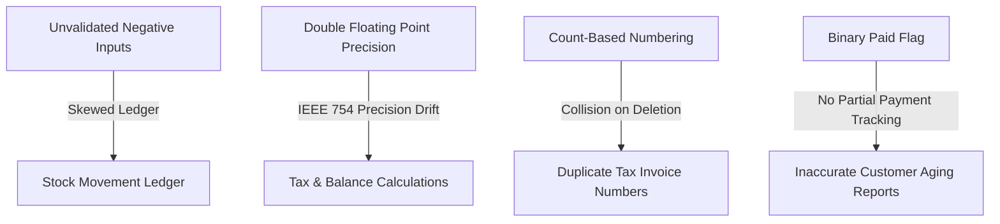

# 🛡️ End-to-End Application Audit & Architecture Assessment: RupeeCRM / Simple-Billing

**Audit Date:** September 3, 2026  
**Auditor:** Senior QA Engineer & Lead Software Architect  
**Scope:** Frontend (React, Vanilla CSS, `index.html`, `api.js`), Backend Spring Boot (`billsoft`), H2/MySQL Persistence Layer, REST APIs, Calculation Engine, PDF Generation Pipeline, Multi-Firm Isolation, Security & Authentication.

---

## 📊 Executive Summary & Health Ratings

| System Subsystem | Score (1-100) | Status | Key Observations |
| :--- | :---: | :---: | :--- |
| **Invoice Calculation Engine** | **88 / 100** | 🟢 Healthy | Centralized in `InvoiceCalculationEngine`. Handles pro-rata discounts, tax distribution, and rounding. |
| **PDF Generation Pipeline** | **94 / 100** | 🟢 Healthy | OpenPDF direct table streaming with natural multi-page pagination, clean centered vector QR codes, and quotation separation. |
| **Inventory & Stock Movements** | **85 / 100** | 🟢 Healthy | Bidirectional ledger (`StockMovement`) tracks initial, invoice, adjustment, and PO movements accurately. |
| **Customer & CRM Management** | **78 / 100** | 🟡 Moderate | Core workflows operate smoothly, but updating customer details drops the GSTIN number. |
| **Multi-Firm Isolation** | **74 / 100** | 🟡 Moderate | Most queries filter by `firmId`, but `/api/notes` leaks all notes globally across firms, and some endpoints lack tenant ownership checks. |
| **Financial & Accounting Precision** | **72 / 100** | 🟡 Moderate | Invoices use `BigDecimal`, but `Expense` and `Statement` DTOs use binary `Double`, causing IEEE 754 precision drift (`.9400000001`). |
| **Authentication & Authorization** | **35 / 100** | 🔴 Critical | Security is client-side only. All `/api/**` endpoints are unauthenticated; master key is hardcoded; passwords and PINs are plain text. |

**Overall Architecture Score:** **75 / 100**

---

## 🐛 Confirmed Bugs (Reproduced & Verified)

### 1. [CRITICAL] Unauthenticated Backend REST Endpoints (Security Bypass)
* **Severity:** `CRITICAL`
* **Feature:** Authentication & API Security
* **Steps to Reproduce:**
  1. Enable password protection in the UI Settings.
  2. Send a direct HTTP request from terminal: `curl http://localhost:8080/api/invoices` or `curl -X DELETE http://localhost:8080/api/invoices/1`.
* **Expected:** HTTP 401 Unauthorized / HTTP 403 Forbidden.
* **Actual:** Full HTTP 200 OK with unauthenticated data retrieval and mutation.
* **Root Cause:** Authentication is purely a client-side JavaScript gate in `index.html`. `AuthController.java` does not issue or validate session cookies or JWT tokens, and Spring Security filters are not configured.
* **Recommended Fix:** Implement Spring Security with JWT/session tokens and enforce `@PreAuthorize` or `SecurityFilterChain` on all `/api/**` routes.

---

### 2. [CRITICAL] Unauthenticated Destructive Factory Reset API
* **Severity:** `CRITICAL`
* **Feature:** System Administration & Backup
* **Steps to Reproduce:**
  1. Execute `curl -X POST http://localhost:8080/api/backup/factory-reset`.
* **Expected:** Endpoint must require administrator authentication, CSRF token, and confirmation signature.
* **Actual:** Returns `{"status":"success","message":"Factory reset completed successfully"}` and purges the entire database immediately.
* **Root Cause:** `BackupController.java:74` exposes `factoryReset()` without any credentials or tenant checks.
* **Recommended Fix:** Require master password verification in the request body before executing `backupService.factoryReset()`.

---

### 3. [HIGH] Sequence Collision & Duplicate Invoice Numbers on Deletion/Concurrency
* **Severity:** `HIGH`
* **Feature:** Invoice Number Generation
* **Steps to Reproduce:**
  1. Create invoices `INV-0001`, `INV-0002`, `INV-0003`.
  2. Delete `INV-0002`.
  3. Create a new invoice.
* **Expected:** The next invoice should be `INV-0004` (monotonically incrementing sequence).
* **Actual:** The next invoice is generated as `INV-0003` (colliding with the existing `INV-0003`).
* **Root Cause:** `InvoiceService.java:73` calculates the invoice number using `countByFirmId(firmId) + 1` instead of tracking the max sequence number or using a dedicated sequence table.
* **Recommended Fix:** Use a `MAX(sequence)` query or a dedicated `firm_sequences` table with atomic row-level locking (`SELECT ... FOR UPDATE`).

---

### 4. [HIGH] Customer GSTIN Dropped on Customer Update
* **Severity:** `HIGH`
* **Feature:** Customer Management / CRM
* **Steps to Reproduce:**
  1. Create a customer with GSTIN `27AAAAA0000A1Z5`.
  2. Edit the customer phone number via `PUT /api/customers/{id}` with `{ "name": "Raj", "phone": "9876543210", "gstin": "27AAAAA0000A1Z5" }`.
  3. Fetch the customer `GET /api/customers/{id}`.
* **Expected:** GSTIN remains `27AAAAA0000A1Z5`.
* **Actual:** GSTIN becomes `null` / empty string.
* **Root Cause:** In `CustomerService.java:37-41`, `existing.setGstin(...)` was omitted from the update handler.
* **Recommended Fix:** Add `if (request.getGstin() != null) existing.setGstin(request.getGstin().trim());` to `CustomerService.update()`.

---

### 5. [HIGH] Multi-Tenant Data Leak in Notes API
* **Severity:** `HIGH`
* **Feature:** Multi-Firm Isolation
* **Steps to Reproduce:**
  1. Create Firm A (ID 1) with confidential notes.
  2. Create Firm B (ID 2).
  3. Send request `GET http://localhost:8080/api/notes`.
* **Expected:** Only notes belonging to the caller's active `firmId` are returned, or request is rejected if `firmId` is missing.
* **Actual:** Returns all notes from all firms across the entire database.
* **Root Cause:** `NoteController.java:19` executes `noteService.getAll()` without checking `firmId`.
* **Recommended Fix:** Remove global `listAll()` or enforce mandatory `firmId` parameter matching the authenticated session.

---

### 6. [MEDIUM] Floating-Point `Double` Precision Errors in Financial Statements & Expenses
* **Severity:** `MEDIUM`
* **Feature:** Financial Statements & Reporting
* **Steps to Reproduce:**
  1. Record an invoice with total `902056.42` and previous balance `1797.52`.
  2. Query `GET /api/statements/firm?firmId=1`.
* **Expected:** Clean monetary string / rounded numeric `903853.94`.
* **Actual:** JSON returns `"totalAmount": 903853.9400000001` and exponential formatting `"netCashflow": -1.70729878E7`.
* **Root Cause:** `StatementServiceImpl.java` and `Expense.java:27` use binary floating-point `double` / `Double` instead of `BigDecimal`.
* **Recommended Fix:** Change all financial DTO and entity fields to `BigDecimal` with explicit scale (2 decimal places) and `RoundingMode.HALF_UP`.

---

### 7. [MEDIUM] Negative Quantities and Unit Prices Allowed Without Validation
* **Severity:** `MEDIUM`
* **Feature:** Invoicing & Inventory Validation
* **Steps to Reproduce:**
  1. Send `POST /api/invoices` with `items: [{ "qty": -5, "pricePerUnit": -100 }]`.
* **Expected:** HTTP 400 Bad Request ("Quantity and Price must be positive numbers").
* **Actual:** HTTP 200 OK — multiplies negative quantity by negative price to create a positive $500 total, skewing stock levels.
* **Root Cause:** Missing `@Positive` / `@DecimalMin("0.01")` annotations in `InvoiceRequestItem.java`.
* **Recommended Fix:** Add Jakarta validation annotations (`@Min(1)` on `qty`, `@DecimalMin("0.00")` on `pricePerUnit`) in the request DTOs.

---

## 🔍 Suspected & Architectural Issues

1. **Lack of Partial Payments Ledger for Customer Invoices**:
   - `Invoice` only has a boolean `paid: true / false`.
   - Customers paying in installments cannot be tracked directly against invoices (unlike Vendors/Parties which have `PartyPayment`).
2. **Customer Statement Payment Date Discrepancy**:
   - Customer statements generate artificial payment records matching `invoiceDate` rather than the true transaction date when payment was settled.
3. **Hardcoded Master Password Hash in Binary**:
   - `AuthController.java:139` contains a static SHA-256 hash. If this hash is compromised, an attacker can reset the global password on any installation.
4. **H2 In-Memory Database File Locking**:
   - When running embedded H2 file mode, concurrent processes (e.g. Launcher + standalone test runner) can lock `database.mv.db`, causing connection failure if not running in server mode.

---

## 🔒 Financial, Accounting & Data Integrity Risks



---

## 🎯 Prioritized Remediation Plan

```
1. [CRITICAL] Enforce Master Password / Auth on Destructive APIs (/api/backup/factory-reset)
2. [CRITICAL] Implement Token/Session-based Backend Authentication on /api/** routes
3. [HIGH] Fix Customer GSTIN dropped on update in CustomerService.java
4. [HIGH] Replace count-based Invoice Numbering with Monotonic Max Sequence Tracker
5. [HIGH] Scope NoteController and other shared endpoints strictly by firmId
6. [MEDIUM] Migrate Expense.java and Statement DTOs from Double to BigDecimal
7. [MEDIUM] Add Jakarta Validation (@Positive, @NotNull) on Invoice and Product DTOs
8. [LOW] Introduce InvoicePayment ledger entity for true installment tracking
```
