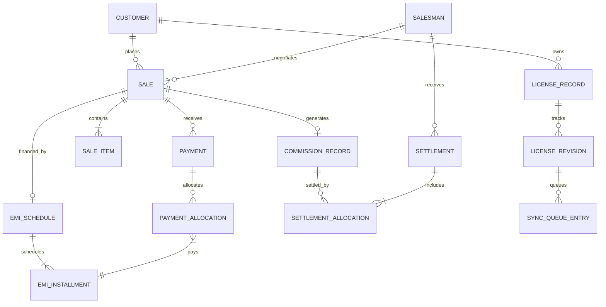
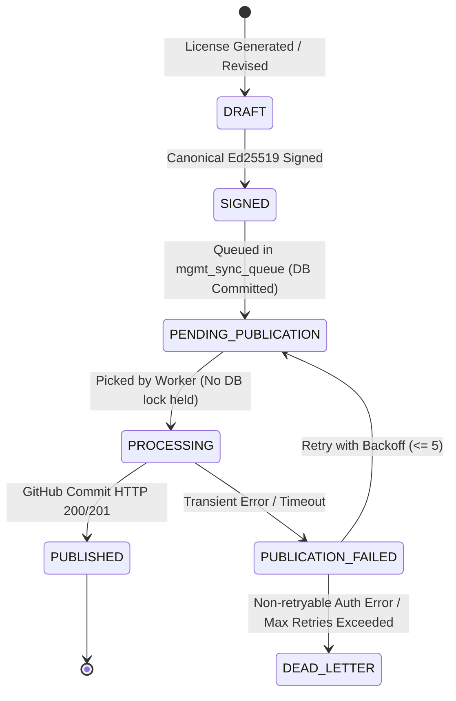
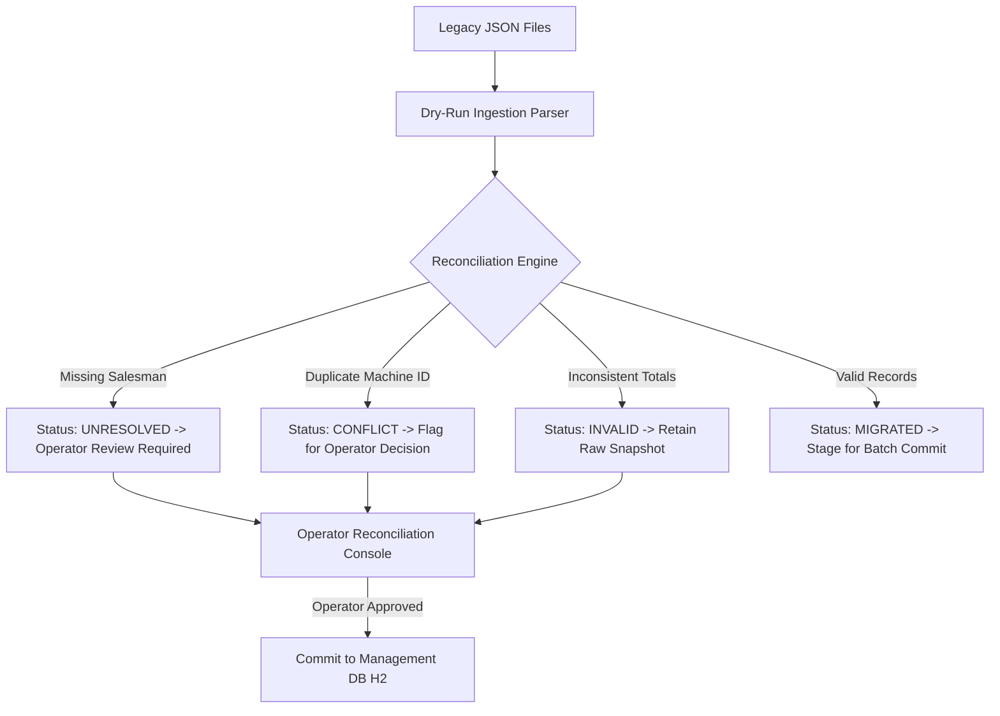

# RUPEECRM — MASTER ARCHITECTURE & IMPLEMENTATION PLAN (FINAL CANONICAL FREEZE)
## Standalone Management Server (`licensemanagement`) + Dynamic EMI Licensing + Sparse Low-Traffic Entitlement Distribution

**DOCUMENT STATUS:** CANONICAL MASTER PLAN — FROZEN FOR EXECUTION  
**PRIMARY RUNTIME PORTS:** Customer Application: `28080` | Management Server: `28090`  
**PERSISTENCE ARCHITECTURE:** Customer App: Embedded DB | Management Server: Dedicated File-Backed H2 (`~/.rupeecrm/mgmt_database.mv.db`)  
**CRYPTOGRAPHIC SECURITY:** Ed25519 Canonical Signatures | AES-256-GCM Management Secrets Vault (`~/.rupeecrm/mgmt_secrets.enc`)  
**REPOSITORY TOPOLOGY:** Strictly Sandboxed Independent Repositories (`Simple-Billing` vs `licensemanagement`)  

---

### 1. Executive Summary

This master document defines the frozen, authoritative architecture and implementation roadmap for replacing `tools/SoftwareManagementTool.html` with a standalone, dedicated **Management Server** (Spring Boot on port `28090` in its own independent repository `licensemanagement`), while embedding an end-to-end **Dynamic EMI / Commercial Entitlement Engine** into the customer licensing lifecycle (`Schema 3`).

```
+---------------------------------------------------------------------------------------------------+
|                         COMMERCIAL CONTROL PLANE (licensemanagement repo)                         |
|                                                                                                   |
|   +--------------------------+         +--------------------------+         +-----------------+   |
|   |  Management Web Console  |  ---->  | Spring Boot 2.7.18(28090)|  ---->  |  Management DB  |   |
|   | (Embedded Web Frontend)  |         | (Sales, Payments, EMI)   |         | (H2 File-Backed)|   |
|   +--------------------------+         +--------------------------+         +-----------------+   |
|                                                      |                                            |
|                                                      | Signs Schema 3 (Ed25519)                   |
|                                                      v                                            |
|                                        +--------------------------+                               |
|                                        |   mgmt_sync_queue (H2)   |                               |
|                                        +--------------------------+                               |
+------------------------------------------------------|--------------------------------------------+
                                                       | Idempotent Bounded REST (PUT)
                                                       v
+---------------------------------------------------------------------------------------------------+
| GITHUB LICENSE REGISTRY (Public Distribution Medium)                                              |
| Path: licenses/{machineId}.lic  |  Payload: Cryptographically Signed Schema 3 JSON blob           |
+---------------------------------------------------------------------------------------------------+
                                                       |
                                                       | Sparse HTTP GET (~1 req/30d or ~1 req/3d)
                                                       v
+---------------------------------------------------------------------------------------------------+
|                         CUSTOMER APPLICATION (Simple-Billing / billsoft repo)                     |
|                                                                                                   |
|   +--------------------------+         +--------------------------+         +-----------------+   |
|   | RupeeCRM SPA (Port 28080)|  <----  |    LicenseCoordinator    |  <----  |  Local License  |   |
|   | (Billing, Stock, DP, UI) |         | (Verified Cache & Gating)|         | (~/.rupeecrm/*.lic)|
|   +--------------------------+         +--------------------------+         +-----------------+   |
+---------------------------------------------------------------------------------------------------+
```

#### Core Architectural Freeze:
1. **Repository Isolation:** The Management Server is built in a completely separate repository `licensemanagement`. There are zero shared code packages, modules, classes, entities, DTOs, or build dependencies between the customer app and the management server.
2. **Management DB (`~/.rupeecrm/mgmt_database.mv.db`):** The absolute financial, accounting, and commercial system of record.
3. **GitHub License Registry (`licenses/{machineId}.lic`):** Solely an external public distribution medium for signed entitlement JSON blobs.
4. **Customer Local License (`~/.rupeecrm/license.lic`):** The last successfully synchronized, verified, and accepted entitlement snapshot.
5. **Customer Local Clock:** Computes in-app warnings and countdowns locally ($0$ network calls). Access restriction requires a cryptographically verified signed entitlement.
6. **Customer GitHub Traffic:** Strictly bounded: ~1 request/30 days (Paid), ~1 request/3 days (Active EMI), on-login check (Restricted/Expired), or a single in-flight request when the customer explicitly triggers manual verification.

---

### 2. Scope & Repository Boundary Contract

The program encompasses two major domains across strictly sandboxed repositories:

```
Customer ──> Sale ──> SaleItems ──> Payment ──> PaymentAllocations ──> EMI Schedule ──> Installments
                                                                                             │
Customer Access <── Local License <── Verified Sync <── Signed GitHub License <── License Entitlement
```

#### Repository Boundary & Integration Contract

```
+---------------------------------------------------------------------------------------------------+
| REPOSITORY ISOLATION MATRIX                                                                       |
+------------------------------+----------------------------------+---------------------------------+
| Architectural Dimension      | Customer Repo (Simple-Billing)   | Management Repo (licensemgmt)   |
+------------------------------+----------------------------------+---------------------------------+
| Git Repository               | `Simple-Billing` (or `billsoft`) | `licensemanagement`             |
| Build System & POM           | Root `pom.xml` -> `billsoft`     | Dedicated standalone `pom.xml`  |
| Primary HTTP Port            | `28080`                          | `28090` (Bound to `127.0.0.1`)  |
| Database Engine              | Embedded H2 / SQLite             | Dedicated File H2 (mgmt_db)     |
| Cryptographic Key            | Ed25519 Public Key Only          | Ed25519 Private Key in Vault    |
| GitHub PAT Access            | Strictly NONE                    | Stored in Encrypted Vault       |
| Tenant Context Model         | Multi-Firm Isolation             | Single Operator Commercial DB   |
| Shared Source Code / DTOs    | STRICTLY NONE                    | STRICTLY NONE                   |
+------------------------------+----------------------------------+---------------------------------+
```

#### Cross-Boundary Integration Contract:
The **ONLY** integration artifacts crossing repository boundaries are:
1. **Signed License JSON Contract:** The JSON schema and canonical Ed25519 signature format published to `licenses/{machineId}.lic`.
2. **Published Announcements JSON Contract:** The public announcement structure fetched by the customer app.
3. **Machine ID Format:** The opaque 16-character Crockford Base32 string (`XXXX-XXXX-XXXX-XXXX`).

---

### 3. Current Architecture Reality

Verification against the active repository (`Simple-Billing`) confirms:
- **Customer Application:** Spring Boot 2.7.18 on port `28080`.
- **UI Architecture:** Single Page Application (HTML5, Vanilla JS, CSS) served from `billsoft/src/main/webapp/index.html` communicating via REST endpoints in `LicensingController.java` (`/api/licensing/*`).
- **Machine Identity (`MachineIdentity.java`):** Generates and persists an opaque 16-character Crockford Base32 Machine ID stored at `~/.rupeecrm/mid.dat`. Hardware fingerprinting is completely absent and strictly prohibited.
- **Licensing Pipeline (`LicensePayload.java`, `LicenseVerifier.java`, `LicenseStorage.java`, `LicenseCoordinator.java`):** Jackson JSON serialization (`@JsonIgnoreProperties(ignoreUnknown = true)`), Ed25519 verification via standard `java.security` over newline-separated canonical strings, local caching in `~/.rupeecrm/license.lic`, and synchronization tracking in `~/.rupeecrm/sync_state.json`.
- **Data Protection (`DataProtectionService.java`):** Encrypted SQLite backup vaults with independent credentials.
- **Announcements (`AnnouncementService.java`):** 48-hour local cache from a dedicated public repository.

---

### 4. Current SoftwareManagementTool Analysis

File `tools/SoftwareManagementTool.html` (6,225 lines) in the legacy toolchain suffers from:
1. **Client-Side Secrets:** GitHub PATs and Ed25519 private keys stored unencrypted in browser `localStorage`.
2. **Unstructured File Storage:** Loose JSON files without relational constraints, foreign keys, or ACID guarantees.
3. **No Double-Entry Financial Tracking:** Payments entered as flat numbers without allocation to sale items or installments.
4. **Direct Browser GitHub Commits:** Unreliable, unbatched GitHub API writes directly from browser JavaScript.

---

### 5. Existing Customer Licensing Analysis & Schema Contract

Inspection of `LicenseVerifier.java` confirms the existing canonical contracts:

- **Schema 1 Canonical Format:**
  `1\n<licenseId>\n<machineId>\n<customerName>\n<product>\n<edition>\n<plan>\n<status>\n<revision>\n<issuedAt>\n<expiresAt>`
- **Schema 2 Canonical Format (with Data Protection):**
  `2\n<licenseId>\n<machineId>\n<customerName>\n<product>\n<edition>\n<plan>\n<status>\n<revision>\n<issuedAt>\n<expiresAt>\n<dpEnabled>\n<dpExpiresAt>`
- **Contract Rule:** Schema 1 and Schema 2 licenses must remain valid and fully verified by `LicenseVerifier.java`.

---

### 6. Target Architecture Overview

The new `licensemanagement` server provides a robust, self-contained commercial control plane:

```
+---------------------------------------------------------------------------------------------------+
| STANDALONE MANAGEMENT SERVER (licensemanagement repo, Port 28090, Spring Boot 2.7.18)              |
|  - Domain: Customer, Sale, SaleItem, Payment, Allocation, EmiSchedule, Commission, LicenseRecord |
|  - Persistence: File-backed H2 (~/.rupeecrm/mgmt_database.mv.db)                                  |
|  - Security: Spring Security session cookies, BCrypt operator auth, AES-256-GCM encrypted vault  |
|  - Engine: EmiCalculationEngine, LicenseIssuanceService, GitHubPublicationWorker, DailyReconciler |
|  - UI: Embedded Single-Page Management Web Console served directly from Spring Boot               |
+---------------------------------------------------------------------------------------------------+
                                                  │
                                                  │ Signs Schema 3 (Ed25519) & commits via REST
                                                  ▼
+---------------------------------------------------------------------------------------------------+
| GITHUB LICENSE REGISTRY (Public Distribution Repository)                                          |
|  - Path: licenses/{machineId}.lic                                                                 |
|  - Payload: Signed Schema 3 JSON blob                                                             |
+---------------------------------------------------------------------------------------------------+
                                                  │
                                                  │ Sparse HTTP GET (Cadence or explicit on-demand)
                                                  ▼
+---------------------------------------------------------------------------------------------------+
| CUSTOMER APPLICATION (Simple-Billing repo, Port 28080, RupeeCRM Core)                             |
|  - LicenseCoordinator: Evaluates sync cadence, verifies Ed25519 signatures, gates features        |
|  - Local Storage: ~/.rupeecrm/license.lic (Verified Entitlement Snapshot)                        |
|  - SPA UI (index.html): Displays daily warnings locally & renders recovery screen if restricted   |
+---------------------------------------------------------------------------------------------------+
```

---

### 7. Authority Model

```
+---------------------------------------------------------------------------------------------------+
| AUTHORITY BOUNDARY CONTRACT                                                                       |
+------------------------+------------------------------------+-------------------------------------+
| Layer                  | Ownership Scope                    | Authority Level                     |
+------------------------+------------------------------------+-------------------------------------+
| Management DB          | Sales, Payments, Allocations, EMI, | Absolute Financial & Commercial     |
| (mgmt_database.mv.db)  | Commissions, Customers, Salesmen   | System of Record                    |
+------------------------+------------------------------------+-------------------------------------+
| GitHub Registry        | Signed License Entitlement Blobs   | Published Distribution Medium Only  |
+------------------------+------------------------------------+-------------------------------------+
| Customer Local License | ~/.rupeecrm/license.lic Cache      | Last Successfully Verified Snapshot |
+------------------------+------------------------------------+-------------------------------------+
| Customer Local Clock   | Current System Time                | Local Warnings & Countdowns Only    |
+------------------------+------------------------------------+-------------------------------------+
```

*Rule:* In any discrepancy, the Management DB is the financial truth. GitHub and Local License reflect published snapshots.

---

### 8. Management Server Foundation

- **Independent Project Root:** `licensemanagement/`
- **Port & Binding:** `127.0.0.1:28090` (localhost only by default).
- **Persistence:** Single-instance file-backed H2 (`jdbc:h2:file:~/.rupeecrm/mgmt_database;DB_CLOSE_ON_EXIT=FALSE;AUTO_RECONNECT=TRUE`).
- **Database Migrations:** Flyway (`db/migration/V1__init_mgmt_schema.sql`).
- **Single Instance Guarantee:** The Management Server is strictly a single-instance commercial control plane. File-level H2 locking prevents concurrent multi-instance writes.

---

### 9. Target Domain Model



---

### 10. Sales & Sale Items

`Sale` and `SaleItem` capture the commercial snapshot:

```java
@Entity
@Table(name = "mgmt_sales")
public class Sale {
    @Id @GeneratedValue(strategy = GenerationType.IDENTITY)
    private Long id;
    
    @Column(nullable = false, unique = true, length = 32)
    private String saleNumber; // SLS-YYYYMMDD-XXXX
    
    @ManyToOne(optional = false, fetch = FetchType.LAZY)
    @JoinColumn(name = "customer_id")
    private Customer customer;
    
    @ManyToOne(optional = true, fetch = FetchType.LAZY)
    @JoinColumn(name = "salesman_id")
    private Salesman salesman;
    
    @Column(nullable = false)
    private LocalDate saleDate;
    
    @Enumerated(EnumType.STRING)
    @Column(nullable = false, length = 20)
    private SaleStatus status; // DRAFT, ACTIVE, COMPLETED, CANCELLED, REVISED
    
    @Column(nullable = false, precision = 12, scale = 2)
    private BigDecimal grossAmount;
    
    @Column(nullable = false, precision = 12, scale = 2)
    private BigDecimal discountAmount;
    
    @Column(nullable = false, precision = 12, scale = 2)
    private BigDecimal netAmount; // agreedPrice = grossAmount - discountAmount
    
    @Enumerated(EnumType.STRING)
    @Column(nullable = false, length = 20)
    private CommercialPaymentType paymentType; // FULL_UPFRONT, EMI_FINANCED
    
    @OneToMany(mappedBy = "sale", cascade = CascadeType.ALL, orphanRemoval = true)
    private List<SaleItem> items = new ArrayList<>();
    
    @OneToOne(mappedBy = "sale", cascade = CascadeType.ALL)
    private EmiSchedule emiSchedule;
}
```

```java
@Entity
@Table(name = "mgmt_sale_items")
public class SaleItem {
    @Id @GeneratedValue(strategy = GenerationType.IDENTITY)
    private Long id;
    
    @ManyToOne(optional = false, fetch = FetchType.LAZY)
    @JoinColumn(name = "sale_id")
    private Sale sale;
    
    @Column(nullable = false, length = 64)
    private String productCode;
    
    @Column(nullable = false, length = 255)
    private String description;
    
    @Column(nullable = false)
    private Integer quantity;
    
    @Column(nullable = false, precision = 12, scale = 2)
    private BigDecimal unitPrice;
    
    @Column(nullable = false, precision = 12, scale = 2)
    private BigDecimal discount;
    
    @Column(nullable = false, precision = 12, scale = 2)
    private BigDecimal lineTotal;
    
    @Column(nullable = false, precision = 5, scale = 2)
    private BigDecimal commissionRateSnapshot;
}
```

---

### 11. Customers

```java
@Entity
@Table(name = "mgmt_customers")
public class Customer {
    @Id @GeneratedValue(strategy = GenerationType.IDENTITY)
    private Long id;
    
    @Column(nullable = false, unique = true, length = 32)
    private String customerCode; // CUST-XXXXX
    
    @Column(nullable = false, length = 255)
    private String businessName;
    
    @Column(nullable = false, length = 255)
    private String contactPerson;
    
    @Column(nullable = false, length = 255)
    private String email;
    
    @Column(nullable = false, length = 32)
    private String phone;
    
    @Column(length = 64)
    private String gstin;
    
    @OneToMany(mappedBy = "customer")
    private List<Sale> sales = new ArrayList<>();
    
    @OneToMany(mappedBy = "customer")
    private List<LicenseRecord> licenses = new ArrayList<>();
}
```

---

### 12. Salesmen

```java
@Entity
@Table(name = "mgmt_salesmen")
public class Salesman {
    @Id @GeneratedValue(strategy = GenerationType.IDENTITY)
    private Long id;
    
    @Column(nullable = false, unique = true, length = 32)
    private String salesmanCode;
    
    @Column(nullable = false, length = 255)
    private String fullName;
    
    @Column(nullable = false, length = 32)
    private String phone;
    
    @Column(nullable = false, precision = 5, scale = 2)
    private BigDecimal defaultCommissionRate;
    
    @Column(nullable = false)
    private Boolean active;
}
```

---

### 13. Payments & Down Payment Accounting

Every payment in the Management Server strictly belongs to a `Sale`. Customer-level unallocated advances are intentionally unsupported.

```java
@Entity
@Table(name = "mgmt_payments")
public class Payment {
    @Id @GeneratedValue(strategy = GenerationType.IDENTITY)
    private Long id;
    
    @Column(nullable = false, unique = true, length = 32)
    private String receiptNumber; // RCT-YYYYMMDD-XXXX
    
    @ManyToOne(optional = false, fetch = FetchType.LAZY)
    @JoinColumn(name = "sale_id")
    private Sale sale;
    
    @Column(nullable = false)
    private LocalDateTime paymentDate;
    
    @Column(nullable = false, precision = 12, scale = 2)
    private BigDecimal amount;
    
    @Enumerated(EnumType.STRING)
    @Column(nullable = false, length = 20)
    private PaymentPurpose purpose; // DOWN_PAYMENT, INSTALLMENT_PAYMENT, FULL_SETTLEMENT
    
    @Enumerated(EnumType.STRING)
    @Column(nullable = false, length = 20)
    private PaymentMode paymentMode; // CASH, UPI, BANK_TRANSFER, CHEQUE
    
    @Column(length = 64)
    private String transactionReference;
    
    @OneToMany(mappedBy = "payment", cascade = CascadeType.ALL, orphanRemoval = true)
    private List<PaymentAllocation> allocations = new ArrayList<>();
}
```

#### Down Payment Accounting Rules:
1. **Sale Receipt:** A down payment is recorded as a `Payment` with `purpose = DOWN_PAYMENT` linked directly to the `Sale`.
2. **Financing Base:** The down payment reduces the total agreed price before installment scheduling:
   $$\text{financedBalance} = \text{totalPayable} - \text{downPayment}$$
3. **No Double-Counting:** Down payment receipts remain unallocated to installments because installments only finance the `financedBalance`.
4. **Reconciliation Formula:**
   $$\text{Total Sale Paid} = \text{DownPayment.amount} + \sum_{\text{all installments}} \text{InstallmentAllocation.allocatedAmount}$$
   $$\text{Outstanding EMI} = \text{financedBalance} - \sum_{\text{all installments}} \text{InstallmentAllocation.allocatedAmount}$$

---

### 14. Payment Allocation Model

`PaymentAllocation` is the authoritative double-entry mapping for installment obligations:

```java
@Entity
@Table(name = "mgmt_payment_allocations")
public class PaymentAllocation {
    @Id @GeneratedValue(strategy = GenerationType.IDENTITY)
    private Long id;
    
    @ManyToOne(optional = false, fetch = FetchType.LAZY)
    @JoinColumn(name = "payment_id")
    private Payment payment;
    
    @ManyToOne(optional = false, fetch = FetchType.LAZY)
    @JoinColumn(name = "installment_id")
    private EmiInstallment installment;
    
    @Column(nullable = false, precision = 12, scale = 2)
    private BigDecimal allocatedAmount;
    
    @Column(nullable = false)
    private LocalDateTime allocatedAt;
}
```

#### Authoritative Allocation Invariants:
1. **Unallocated Balance Rule:**
   $$\sum \text{PaymentAllocation.allocatedAmount} \le \text{Payment.amount}$$
   $$\text{unallocatedAmount} = \text{Payment.amount} - \sum \text{PaymentAllocation.allocatedAmount}$$
2. **Installment Reconciliation:**
   $$\text{EmiInstallment.paidAmount} = \sum_{\text{valid allocations}} \text{PaymentAllocation.allocatedAmount}$$

---

### 15. Dynamic EMI Financial Model

The system supports 3 mathematically closed interest models:

```
+---------------------------------------------------------------------------------------------------+
| EMI INTEREST MODELS & FORMULAS                                                                    |
+-------------------+---------------------------------------+---------------------------------------+
| Model             | Base Financed & Interest Formula      | Total Payable & Installments          |
+-------------------+---------------------------------------+---------------------------------------+
| 1. NO_COST        | agreedPrice = Net Sale Price          | totalPayable = agreedPrice            |
|                   | financedBalance = agreedPrice-downPay | BaseInst = financedBalance / N        |
|                   | totalInterest = 0.00                  | Inst_N = financedBalance - SUM(1..N-1)|
+-------------------+---------------------------------------+---------------------------------------+
| 2. FLAT_RATE      | agreedPrice = Net Sale Price          | totalInterest = round(financedAmount  |
|                   | financedAmount = agreedPrice - downPay|   * rate/100 * tenure/12, 2)          |
|                   | financedBalance = financedAmount +    | totalPayable = downPayment +          |
|                   |                   totalInterest       |                financedBalance        |
|                   |                                       | BaseInst = financedBalance / N        |
|                   |                                       | Inst_N = financedBalance - SUM(1..N-1)|
+-------------------+---------------------------------------+---------------------------------------+
| 3. FIXED_TOTAL    | agreedPrice = Net Sale Price          | totalPayable = Operator Approved Gross|
|                   | downPayment >= 0                      | financedBalance = totalPayable-downPay|
|                   | totalInterest = totalPayable -        | BaseInst = financedBalance / N        |
|                   |                 agreedPrice           | Inst_N = financedBalance - SUM(1..N-1)|
+-------------------+---------------------------------------+---------------------------------------+
```

#### Exact Rounding & Residual Balancing:
For tenure $N$ and financed balance $B$:
1. Base amount: $\text{baseAmount} = \text{round}_{\text{HALF\_UP}}\left(\frac{B}{N}, 2\right)$.
2. Installments $1 \dots (N-1)$: $\text{Installment}[k].\text{amount} = \text{baseAmount}$.
3. Final installment ($N$): $\text{Installment}[N].\text{amount} = B - \sum_{j=1}^{N-1} \text{Installment}[j].\text{amount}$.

#### Separation of Schedule State and Installment State:
- **Installment Statuses:** `UPCOMING`, `DUE`, `IN_GRACE`, `PARTIAL`, `OVERDUE`, `PAID`, `WAIVED`.
- **EMI Schedule Statuses:** `ACTIVE`, `COMPLETED`, `WAIVED`, `CANCELLED`.
- **Definition of `currentInstallment`:** The lowest installment sequence number where `status` is not `PAID` and not `WAIVED`.
- **Schedule Completion:** When all $N$ installments are `PAID` or `WAIVED`:
  $$\text{schedule.status} = \text{COMPLETED}, \quad \text{outstandingAmount} = 0.00, \quad \text{currentInstallment} = \text{null}$$
  $$\text{nextDueDate} = \text{null}, \quad \text{graceDeadline} = \text{null}, \quad \text{accessStatus} = \text{NORMAL}$$

---

### 16. Combined Customer Entitlement Decision Model

Access gating in the customer application evaluates both top-level license status and nested EMI status:

```
+---------------------------------------------------------------------------------------------------+
| COMBINED ENTITLEMENT DECISION MATRIX                                                              |
+-------------------+-----------------------+-----------------------+-------------------------------+
| License Status    | EMI Access Status     | Effective Access      | Customer App Behavior         |
+-------------------+-----------------------+-----------------------+-------------------------------+
| REVOKED           | Any                   | REVOKED               | Hard Lock: License Revoked    |
| SUSPENDED         | Any                   | SUSPENDED             | Hard Lock: License Suspended  |
| EXPIRED           | Any                   | EXPIRED               | Existing Expiration Gating    |
| ACTIVE            | RESTRICTED            | EMI_RESTRICTED        | Lock: Recovery Screen Only    |
| ACTIVE            | NORMAL                | ACTIVE                | Full Normal Software Access   |
+-------------------+-----------------------+-----------------------+-------------------------------+
```

*Invariant:* EMI restriction is strictly an installment default condition and never overwrites or alters existing license expiration, suspension, or revocation semantics.

---

### 17. Commission Model

```java
@Entity
@Table(name = "mgmt_commission_records")
public class CommissionRecord {
    @Id @GeneratedValue(strategy = GenerationType.IDENTITY)
    private Long id;
    
    @OneToOne(optional = false, fetch = FetchType.LAZY)
    @JoinColumn(name = "sale_id")
    private Sale sale;
    
    @ManyToOne(optional = false, fetch = FetchType.LAZY)
    @JoinColumn(name = "salesman_id")
    private Salesman salesman;
    
    @Column(nullable = false, precision = 12, scale = 2)
    private BigDecimal baseCommissionableAmount;
    
    @Column(nullable = false, precision = 5, scale = 2)
    private BigDecimal effectiveRate; // Snapshot of salesman commission rate at sale time
    
    @Column(nullable = false, precision = 12, scale = 2)
    private BigDecimal totalCommissionEarned;
    
    @Column(nullable = false, precision = 12, scale = 2)
    private BigDecimal settledAmount;
    
    @Enumerated(EnumType.STRING)
    @Column(nullable = false, length = 20)
    private CommissionStatus status; // UNSETTLED, PARTIALLY_SETTLED, FULLY_SETTLED
}
```

*Invariant:* Historical commissions remain immutable. Modifying a salesman's default commission rate never alters prior commission records.

---

### 18. Settlements

```java
@Entity
@Table(name = "mgmt_settlements")
public class Settlement {
    @Id @GeneratedValue(strategy = GenerationType.IDENTITY)
    private Long id;
    
    @Column(nullable = false, unique = true, length = 32)
    private String settlementNumber; // SET-YYYYMMDD-XXXX
    
    @ManyToOne(optional = false, fetch = FetchType.LAZY)
    @JoinColumn(name = "salesman_id")
    private Salesman salesman;
    
    @Column(nullable = false)
    private LocalDateTime settlementDate;
    
    @Column(nullable = false, precision = 12, scale = 2)
    private BigDecimal totalAmount;
    
    @OneToMany(mappedBy = "settlement", cascade = CascadeType.ALL, orphanRemoval = true)
    private List<SettlementAllocation> allocations = new ArrayList<>();
}
```

---

### 19. License Lifecycle & Cardinalities

- **Customer to License:** 1 Customer $\rightarrow$ Many Licenses.
- **Machine Binding:** Exactly **1 active license per persistent Machine ID**.
- **Sale to License:** Initial sale creates `LicenseRecord` (`revision = 1`). Subsequent renewals or upgrades update the existing `LicenseRecord` and increment `revision`.
- **Machine Rebinding:** Moving an account to a new machine marks the old machine's license `REVOKED` and creates a new license record for the new `MachineId`.

---

### 20. License Schema 3 JSON Specification

Schema 3 preserves all existing fields and nests the signed `emi` object:

```json
{
  "schemaVersion": 3,
  "licenseId": "LIC-2026-00892",
  "machineId": "B7X9-K2M4-P8Q1-W3Z5",
  "customerName": "Apex Retail Enterprises",
  "product": "RupeeCRM",
  "edition": "PROFESSIONAL",
  "plan": "ENTERPRISE",
  "status": "ACTIVE",
  "revision": 4,
  "issuedAt": "2026-09-23T00:00:00Z",
  "expiresAt": "2027-09-23T23:59:59Z",
  "dataProtectionEnabled": true,
  "dataProtectionExpiresAt": "2027-09-23T23:59:59Z",
  "statusReason": null,
  "emi": {
    "enabled": true,
    "pricing": {
      "agreedPrice": 24000.00,
      "downPayment": 4000.00,
      "financedAmount": 20000.00,
      "interestType": "NO_COST",
      "interestRate": 0.00,
      "totalInterest": 0.00,
      "totalPayable": 24000.00
    },
    "schedule": {
      "tenureMonths": 4,
      "interval": "MONTHLY",
      "firstDueDate": "2026-10-01",
      "graceDays": 7,
      "installmentAmount": 5000.00
    },
    "state": {
      "paidAmount": 9000.00,
      "outstandingAmount": 15000.00,
      "currentInstallment": 2,
      "nextDueDate": "2026-11-01",
      "graceDeadline": "2026-11-08",
      "emiStatus": "ACTIVE",
      "accessStatus": "NORMAL"
    }
  },
  "signature": "MEQCID...<Base64_Ed25519_Signature>..."
}
```

---

### 21. Canonical Signing Specification

Every entitlement-bearing field in Schema 3 is canonicalized and signed using Ed25519.

#### Complete Canonical Token Sequence:
The signing string is constructed by concatenating the following tokens separated by `\n` (UTF-8 newline):

```
1.  schemaVersion               --> "3"
2.  licenseId                   --> sanitize(license.getLicenseId())
3.  machineId                   --> sanitize(license.getMachineId())
4.  customerName                --> sanitize(license.getCustomerName())
5.  product                     --> sanitize(license.getProduct())
6.  edition                     --> sanitize(license.getEdition())
7.  plan                        --> license.getPlan() != null ? license.getPlan().name() : ""
8.  status                      --> license.getStatus() != null ? license.getStatus().name() : ""
9.  revision                    --> String.valueOf(license.getRevision())
10. issuedAt                    --> license.getIssuedAt() != null ? license.getIssuedAt().toString() : ""
11. expiresAt                   --> license.getExpiresAt() != null ? license.getExpiresAt().toString() : "LIFETIME"
12. dpEnabled                   --> String.valueOf(license.getDataProtectionEnabled())
13. dpExpiresAt                 --> license.getDataProtectionExpiresAt() != null ? license.getDataProtectionExpiresAt().toString() : "LIFETIME"
14. statusReason                --> sanitize(license.getStatusReason())
15. emi.enabled                 --> String.valueOf(emi.isEnabled())
--- (If emi.enabled == true, append tokens 16 through 32) ---
16. emi.pricing.agreedPrice     --> String.format(Locale.US, "%.2f", agreedPrice)
17. emi.pricing.downPayment     --> String.format(Locale.US, "%.2f", downPayment)
18. emi.pricing.financedAmount  --> String.format(Locale.US, "%.2f", financedAmount)
19. emi.pricing.interestType    --> interestType.name()
20. emi.pricing.interestRate    --> String.format(Locale.US, "%.2f", interestRate)
21. emi.pricing.totalInterest   --> String.format(Locale.US, "%.2f", totalInterest)
22. emi.pricing.totalPayable    --> String.format(Locale.US, "%.2f", totalPayable)
23. emi.schedule.tenureMonths   --> Integer.toString(tenureMonths)
24. emi.schedule.interval       --> interval.name()
25. emi.schedule.firstDueDate   --> firstDueDate.toString()
26. emi.schedule.graceDays      --> Integer.toString(graceDays)
27. emi.schedule.installmentAmt --> String.format(Locale.US, "%.2f", installmentAmount)
28. emi.state.paidAmount        --> String.format(Locale.US, "%.2f", paidAmount)
29. emi.state.outstandingAmount --> String.format(Locale.US, "%.2f", outstandingAmount)
30. emi.state.currentInstNum    --> (currentInstallment == null ? "NULL" : Integer.toString(currentInstallment))
31. emi.state.nextDueDate       --> (nextDueDate == null ? "NULL" : nextDueDate.toString())
32. emi.state.graceDeadline     --> (graceDeadline == null ? "NULL" : graceDeadline.toString())
33. emi.state.emiStatus         --> emiStatus.name()
34. emi.state.accessStatus      --> accessStatus.name()
```

#### Sanitization and Formatting Rules:
- Strings are trimmed and internal `\r` and `\n` characters are replaced with empty strings (`""`).
- `BigDecimal` values format with exactly 2 decimal places using `Locale.US` (e.g. `24000.00`).
- Schema version increments are required for any future entitlement field additions.

---

### 22. Publication State Machine & Transaction Boundaries



#### Non-Blocking Transaction Boundary:
1. **DB Transaction:** Inserts/updates `SyncQueueEntry` in H2 and commits.
2. **Asynchronous Worker:** Picks up `PENDING` queue items outside the DB transaction.
3. **Pre-Publish Revalidation:** Immediately before executing the GitHub REST PUT, the worker verifies that the active database state still matches the job. If an intervening payment has occurred, the stale job is discarded and the new state is published.
4. **Result Commit:** Updates `SyncQueueEntry` status in a short, dedicated transaction upon completion.

#### Idempotent Management Overdue Reconciliation:
The daily reconciliation task queries the local Management DB for active overdue installments. It compares the newly computed entitlement with the currently published revision; a new revision and publication job are generated **only if the entitlement state actually transitions**. Repeated runs on the same day produce zero redundant revisions or GitHub calls.

---

### 23. Customer Synchronization Policy

Governed centrally by `LicenseCoordinator` in `Simple-Billing`:

```
+---------------------------------------------------------------------------------------------------+
| CUSTOMER SYNCHRONIZATION CADENCE RULES                                                            |
+------------------------+------------------------------------+-------------------------------------+
| Customer State         | Synchronization Trigger            | Exact GitHub Request Rate           |
+------------------------+------------------------------------+-------------------------------------+
| Fully Paid / Non-EMI   | Every 30 calendar days on startup  | ~1 request / month / customer       |
+------------------------+------------------------------------+-------------------------------------+
| Active Outstanding EMI | Every 3 calendar days on startup   | ~10 requests / month / customer     |
+------------------------+------------------------------------+-------------------------------------+
| "I Have Paid EMI"      | Single explicit button action      | Exactly 1 request (In-flight locked)|
+------------------------+------------------------------------+-------------------------------------+
| EMI Restricted         | On application login only          | ~1 request / login (0 during session|
+------------------------+------------------------------------+-------------------------------------+
| Expired License        | On application login only          | ~1 request / login (0 during session|
+------------------------+------------------------------------+-------------------------------------+
```

---

### 24. GitHub Request Policy Boundary Enforcement

```
+---------------------------------------------------------------------------------------------------+
| GITHUB NETWORK CALL BOUNDARY ENFORCEMENT                                                          |
+---------------------------------------------------+-----------------------------------------------+
| ACTION / EVENT                                    | GITHUB REQUEST STATUS                         |
+---------------------------------------------------+-----------------------------------------------+
| App Startup (Cadence not reached)                 | ZERO REQUESTS                                 |
| App Startup (30d / 3d Cadence reached)            | EXACTLY 1 REQUEST                             |
| SPA Dashboard Navigation                          | ZERO REQUESTS                                 |
| Invoice Creation, Edit, Save, or Delete           | ZERO REQUESTS                                 |
| Invoice PDF Generation / Thermal Printing         | ZERO REQUESTS                                 |
| EMI Due Soon / Due Today Local Popup Render       | ZERO REQUESTS                                 |
| Dismissing EMI Popup                              | ZERO REQUESTS                                 |
| User clicks [ I HAVE PAID EMI ]                   | EXACTLY 1 REQUEST                             |
| Rapidly clicking [ I HAVE PAID ] + [ CHECK STATUS]| EXACTLY 1 REQUEST (Protected by Mutex)        |
+---------------------------------------------------+-----------------------------------------------+
```

---

### 25. Local EMI Warning System

All countdowns and alert thresholds are computed purely locally from the verified license:
- **7 Days Before Due:** Local notification banner: *"Upcoming EMI of ₹X due on YYYY-MM-DD."*
- **Due Date:** Local modal: *"EMI of ₹X is due today."*
- **In Grace Period:** Local warning: *"EMI overdue. Grace period active for X more days."*
- **Frequency Limit:** Maximum **one modal popup per calendar day**, tracked via `lastEmiReminderDate` in `sync_state.json`.

---

### 26. Restricted Customer Recovery & Mutex

When `effectiveAccess == EMI_RESTRICTED`, the SPA locks normal routes and renders the recovery interface:

```
+---------------------------------------------------------------------------------------------------+
| RUPEECRM LICENSE RECOVERY                                                                         |
+---------------------------------------------------------------------------------------------------+
| [!] SOFTWARE ACCESS CURRENTLY RESTRICTED                                                          |
|                                                                                                   |
| Software access is restricted due to an overdue EMI installment.                                  |
|                                                                                                   |
| - Overdue Installment : #2 of 4                                                                   |
| - Overdue Amount      : ₹5,000.00                                                                 |
| - Due Date            : 2026-10-01                                                                |
| - Grace Deadline      : 2026-10-08                                                                |
| - Support Contact     : support@rupeecrm.com | +91 98765 43210                                    |
|                                                                                                   |
|        [ I HAVE PAID EMI ]                       [ CHECK LICENSE STATUS ]                         |
+---------------------------------------------------------------------------------------------------+
```

#### In-Flight Mutex Protection:
Clicking either button acquires an in-flight synchronization mutex (`syncInProgress = true`), disables both buttons, performs a single cryptographic fetch from GitHub, updates local entitlement if a signed valid revision is found, and releases the mutex.

---

### 27. Offline Semantics

- **Local Clock Responsibility:** Drives countdown warnings and local reminder banners only.
- **Signed License Responsibility:** Drives software entitlement restriction.
- **Tradeoff Contract:** An offline customer whose grace deadline has passed remains in `NORMAL` status until the application successfully synchronizes a cryptographically signed `RESTRICTED` entitlement from GitHub.

---

### 28. Network Failure Semantics

**Invariant:** **The last cryptographically verified entitlement state is strictly preserved across all network failures.**
- `NORMAL` + Network Error $\rightarrow$ Remains `NORMAL`.
- `IN_GRACE` + Network Error $\rightarrow$ Remains `IN_GRACE`.
- `RESTRICTED` + Network Error $\rightarrow$ Remains `RESTRICTED`.
- `EXPIRED` + Network Error $\rightarrow$ Preserves existing expiration behavior.

---

### 29. Migration & Cutover Lifecycle for `SoftwareManagementTool.html`



#### Cutover Lifecycle:
1. **Phase 1 (Ingestion):** Historical data is imported with zero guessing (unresolved references require operator review).
2. **Phase 2 (Parallel Verification):** Management Server runs in parallel on port `28090`. `SoftwareManagementTool.html` is retained for fallback.
3. **Phase 3 (Read-Only Cutover):** `SoftwareManagementTool.html` is switched to read-only mode.
4. **Phase 4 (Deprecation):** Legacy tool is archived once the Management Server is fully validated.

---

### 30. Management Server Security

- **Localhost Binding:** Binds strictly to `127.0.0.1:28090`.
- **Operator Auth:** Spring Security session cookies (`JSESSIONID`) with `SameSite=Strict` and `HttpOnly=true`. Passwords hashed via BCrypt (strength 12).
- **Secrets Vault:** `~/.rupeecrm/mgmt_secrets.enc` encrypted via AES-256-GCM.
- **Zero Client-Side Secrets:** Neither the customer app nor the browser ever receives the Management PAT or Ed25519 signing private key.

---

### 31. Tenant Isolation Clarification

- **Management Server:** Is a single-operator commercial system representing the software vendor. It does NOT implement multi-firm customer tenant isolation.
- **Customer Application:** Retains its existing `TenantContext` and multi-firm isolation completely untouched.

---

### 32. Append-Only Application Audit Trail

Commercial actions are written to `mgmt_audit_log`:
- Logged actions: `SALE_CREATE`, `SALE_CORRECT`, `PAYMENT_RECEIVE`, `PAYMENT_ALLOCATE`, `EMI_SCHEDULE_CREATE`, `LICENSE_ISSUE`, `LICENSE_REVISE`, `SETTLEMENT_RECORD`, `GITHUB_PUBLISH`.
- Service-level operations prohibit `UPDATE` and `DELETE` on audit records.

---

### 33. Announcements Contract

- Broadcast announcements are published by the Management Server to the dedicated announcements repository using the established schema.
- Customer application preserves its 48-hour local cache ($0$ per-screen network calls).

---

### 34. Data Protection Contract

- Data Protection client-side backup vaults (AES-256-GCM encrypted SQLite) remain independent and fully preserved.
- Customer licensing gates access to DP features via Schema 3 `dataProtectionEnabled` and `dataProtectionExpiresAt`.

---

### 35. Management UI Information Architecture

The embedded web console in `licensemanagement` provides:
- **Dashboard:** Revenue totals, collection status, overdue EMI metrics, expiring licenses, and publication queue status.
- **Sales & Orders:** Sale creation, product catalog, payments, and dynamic EMI schedule setup.
- **Customers:** Customer directory, linked machine IDs, and billing histories.
- **Licenses & EMI:** License issuance, Schema 3 entitlement editor, instant publish trigger, and sync queue monitor.
- **Salesmen & Commissions:** Commission tracking, statement generator, and settlements.
- **Reports:** Collection reports, EMI aging analysis, and salesman ledger exports.
- **Config:** Operator management, GitHub PAT settings, Ed25519 key generation, and audit trail viewer.

---

### 36. Financial Reports

- **Sales Ledger Report:** Filterable by date, payment mode, salesman, and product code.
- **EMI Aging Analysis:** Categorized by aging buckets (Current, $1-7$ days overdue, $8-30$ days overdue, $>30$ days overdue).
- **Salesman Statement:** Detailed commission ledger showing linked sale numbers, snapshot commission rates, and disbursed settlement allocations.

---

### 37. Performance Acceptance Targets

- **Startup Time Target:** Management Server boots in $< 3.0$ seconds on standard developer workstation.
- **Idle Memory Target:** Management Server maintains idle heap $< 120\text{ MB}$.
- **Database Optimization:** Indexed foreign keys and search columns on `saleNumber`, `customerCode`, `machineId`, and `status`.

---

### 38. Comprehensive Test Strategy & Matrix

```
+---------------------------------------------------------------------------------------------------+
| MASTER TEST SPECIFICATION                                                                         |
+-------------------------------+-------------------------------------------------------------------+
| Test Suite                    | Validation Criteria                                               |
+-------------------------------+-------------------------------------------------------------------+
| EMI Engine Unit Tests         | - NO_COST, FLAT_RATE, FIXED_TOTAL mathematical calculations       |
|                               | - Exact zero-residual final installment balancing                 |
|                               | - Payment allocation invariant checks                             |
+-------------------------------+-------------------------------------------------------------------+
| Cryptographic Signing Tests   | - Ed25519 signing and verification over Schema 3 canonical tokens |
|                               | - Tamper detection across all 34 individual canonical tokens      |
|                               | - Backward compatibility for Schema 1 and Schema 2 licenses       |
+-------------------------------+-------------------------------------------------------------------+
| Low-Traffic Cadence Tests     | - 30-day elapsed cadence triggers exactly 1 sync                  |
|                               | - 3-day EMI cadence triggers exactly 1 sync                       |
|                               | - Zero network requests on dashboard, invoice, and popup renders  |
|                               | - Mutex in-flight lock on recovery buttons                        |
+-------------------------------+-------------------------------------------------------------------+
| Request-Count Proof Tests     | - 100 popup evaluations => 0 GitHub calls                         |
|                               | - 100 dashboard navigations => 0 GitHub calls                     |
|                               | - 100 invoice creations => 0 GitHub calls                         |
+-------------------------------+-------------------------------------------------------------------+
```

---

### 39. Exact File Impact Analysis

```
================================================================================
NEW REPOSITORY: licensemanagement (Completely Standalone Maven Project)
================================================================================
licensemanagement/pom.xml
licensemanagement/src/main/java/com/rupeecrm/mgmt/ManagementServerApplication.java
licensemanagement/src/main/java/com/rupeecrm/mgmt/config/SecurityConfig.java
licensemanagement/src/main/java/com/rupeecrm/mgmt/config/SecretsVault.java
licensemanagement/src/main/java/com/rupeecrm/mgmt/domain/Customer.java
licensemanagement/src/main/java/com/rupeecrm/mgmt/domain/Salesman.java
licensemanagement/src/main/java/com/rupeecrm/mgmt/domain/Sale.java
licensemanagement/src/main/java/com/rupeecrm/mgmt/domain/SaleItem.java
licensemanagement/src/main/java/com/rupeecrm/mgmt/domain/Payment.java
licensemanagement/src/main/java/com/rupeecrm/mgmt/domain/PaymentAllocation.java
licensemanagement/src/main/java/com/rupeecrm/mgmt/domain/EmiSchedule.java
licensemanagement/src/main/java/com/rupeecrm/mgmt/domain/EmiInstallment.java
licensemanagement/src/main/java/com/rupeecrm/mgmt/domain/CommissionRecord.java
licensemanagement/src/main/java/com/rupeecrm/mgmt/domain/Settlement.java
licensemanagement/src/main/java/com/rupeecrm/mgmt/domain/SettlementAllocation.java
licensemanagement/src/main/java/com/rupeecrm/mgmt/domain/LicenseRecord.java
licensemanagement/src/main/java/com/rupeecrm/mgmt/domain/SyncQueueEntry.java
licensemanagement/src/main/java/com/rupeecrm/mgmt/domain/AuditLogEntry.java
licensemanagement/src/main/java/com/rupeecrm/mgmt/service/EmiCalculationEngine.java
licensemanagement/src/main/java/com/rupeecrm/mgmt/service/LicenseIssuanceService.java
licensemanagement/src/main/java/com/rupeecrm/mgmt/service/GitHubPublicationWorker.java
licensemanagement/src/main/java/com/rupeecrm/mgmt/service/DailyReconciliationTask.java
licensemanagement/src/main/java/com/rupeecrm/mgmt/service/LegacyMigrationService.java
licensemanagement/src/main/resources/application.properties
licensemanagement/src/main/resources/db/migration/V1__init_mgmt_schema.sql
licensemanagement/src/main/resources/static/index.html
licensemanagement/src/main/resources/static/css/mgmt.css
licensemanagement/src/main/resources/static/js/mgmt.js

================================================================================
MODIFIED FILES IN EXISTING REPO: Simple-Billing (Customer App Gating)
================================================================================
billsoft/src/main/java/com/billing/simple/billsoft/licensing/model/LicensePayload.java (Add Schema 3 EMI DTO)
billsoft/src/main/java/com/billing/simple/billsoft/licensing/LicenseVerifier.java (Schema 3 Verification)
billsoft/src/main/java/com/billing/simple/billsoft/licensing/LicenseCoordinator.java (Cadence & EMI Gating)
billsoft/src/main/webapp/js/api.js (Recovery & Local Daily Warning Handler)
billsoft/src/main/webapp/index.html (Recovery View Container)
```

---

### 40. Protected Files (DO NOT MODIFY)

The following core modules in `Simple-Billing` are strictly protected:
- `MachineIdentity.java` (Crockford Base32 ID semantics preserved)
- `InvoiceService.java`, `InvoiceItem.java`, `InvoicePayment.java` (Customer billing engine untouched)
- `DataProtectionService.java` (DP SQLite vault preserved)
- `AnnouncementService.java` (48-hour announcement cache preserved)
- `TenantContext.java` (Multi-firm isolation preserved)

---

### 41. Implementation Phases

```
+---------------------------------------------------------------------------------------------------+
| PHASED IMPLEMENTATION ROADMAP                                                                     |
+----------+----------------------------------+-----------------------------------------------------+
| Phase    | Scope                            | Deliverables                                        |
+----------+----------------------------------+-----------------------------------------------------+
| Phase 0  | Baseline & Verification          | Maven clean verification, test baseline capture     |
| Phase 1  | New Repo Setup (licensemgmt)     | Standalone Spring Boot repo on port 28090           |
| Phase 2  | Domain Model & Flyway H2 Schema  | JPA entities, tables, indexes, repositories         |
| Phase 3  | Security & Secrets Vault         | Session auth, AES-256-GCM vault enclave             |
| Phase 4  | Dynamic EMI Calculation Engine   | Math formulas, residual balancing, unit tests       |
| Phase 5  | Schema 3 License Signing Engine  | Ed25519 signing, canonicalization, tamper tests     |
| Phase 6  | Customer Cadence Sync Engine     | Low-traffic 5-tier sync engine in Customer App      |
| Phase 7  | GitHub Publication Queue Worker  | Idempotent sync worker, pre-publish revalidation    |
| Phase 8  | Customer Recovery View & Alerts  | Local EMI warnings, recovery UI, in-flight lock     |
| Phase 9  | Migration & Reconciliation Tool  | Ingestion tool for legacy JSON files                |
| Phase 10 | Management Web Console UI        | Complete embedded web dashboard & workflows         |
| Phase 11 | End-to-End System Verification   | Full request-count tests & regression validation    |
| Phase 12 | Legacy Tool Deprecation          | Transition tools/SoftwareManagementTool.html        |
+----------+----------------------------------+-----------------------------------------------------+
```

---

### 42. Rollback Strategy

1. **Repository Isolation:** Because `licensemanagement` is an entirely separate repository, changes there carry zero risk of breaking customer application compilation or deployment.
2. **Backward Compatibility:** The customer application's Schema 3 parser is strictly backward-compatible with Schema 1 and Schema 2 licenses.
3. **Legacy Tool Fallback:** `tools/SoftwareManagementTool.html` is retained during the verification period before final deprecation.

---

### 43. Remaining Risks & Mitigations

- **Clock Rollback Risk:** `LicenseCoordinator` verifies that system clock $\ge$ `lastKnownTimestamp` persisted in local state.
- **GitHub Rate Limit / Outage Risk:** Publication worker uses exponential backoff; customer application relies on its verified local license snapshot during outages.

---

### 44. Final Architectural Invariants

1. **Management DB = Current commercial and financial truth.**
2. **GitHub = Published signed entitlement distribution medium only.**
3. **Customer Local License = Last successfully verified entitlement snapshot.**
4. **Machine ID remains the existing opaque persistent 16-character Crockford Base32 ID.**
5. **Schema 1 and Schema 2 licenses remain fully compatible.**
6. **Schema 3 signs every entitlement-bearing property.**
7. **PaymentAllocation is authoritative for payment distribution.**
8. **EMI Schedule agreement state and Installment state are strictly separate.**
9. **Down payments are recorded as formal Payment receipts in the financial ledger.**
10. **Management Server performs lightweight local overdue evaluation (zero customer polling).**
11. **Customer application performs no unnecessary GitHub polling.**
12. **Fully paid customers synchronize approximately once every 30 days.**
13. **Active outstanding EMI customers synchronize approximately once every 3 days.**
14. **"I Have Paid EMI" triggers exactly one immediate synchronization attempt.**
15. **Restricted customers synchronize on login.**
16. **Expired licenses synchronize on login according to existing expiry semantics.**
17. **Popup and screen rendering causes zero GitHub requests.**
18. **Network failures strictly preserve the last verified entitlement state.**
19. **Local clock produces in-app warnings, not new signed entitlement states.**
20. **Payment and restriction publications undergo pre-publish revalidation.**
21. **GitHub publication is idempotent and bounded.**
22. **Management secrets never enter the customer application or browser storage.**
23. **Migration never silently guesses ambiguous business data.**
24. **Historical commission snapshots remain immutable and reproducible.**
25. **Tenant isolation in customer app is preserved; Management Server operates as a single-operator commercial system.**
26. **Complete repository isolation: `licensemanagement` is an independent repository with zero shared code packages or build dependencies with `Simple-Billing`.**

---

### 45. Final Verdict

$$\mathbf{READY\ FOR\ IMPLEMENTATION}$$

All architectural requirements, mathematical models, cryptographic specifications, synchronization policies, data migration rules, and repository isolation boundaries are fully defined, internally consistent, and frozen. Implementation may proceed immediately upon user approval.
