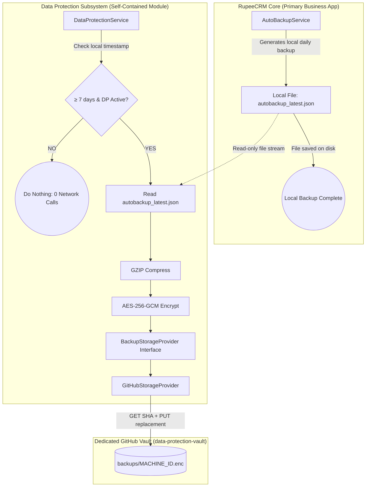
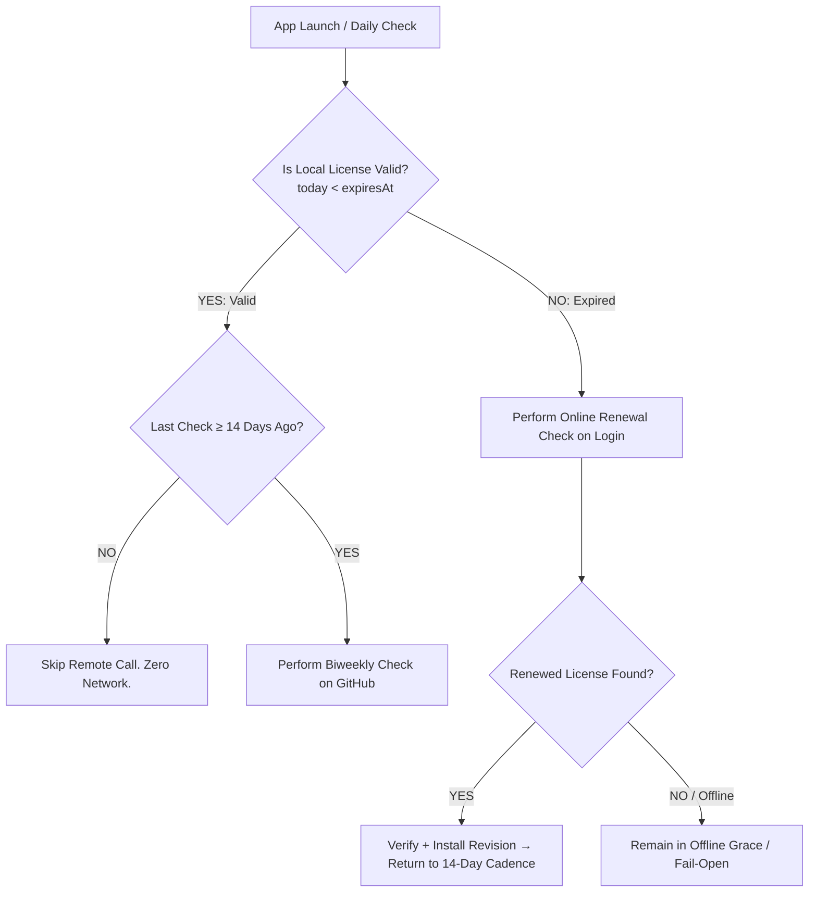

# RupeeCRM — Data Protection Add-on
## Simplified Architecture & Practical Implementation Plan (Version 3.4 - Final Approved)

**Document Version:** 3.4 (Final Approved Architecture & Implementation Plan)  
**Date:** September 15, 2026  
**Status:** Approved Read-Only Architecture & Implementation Plan  
**Target System:** RupeeCRM Desktop Application  
**Author:** DeepMind / Antigravity Engineering

---

## Table of Contents
1. [Core Architectural Principles](#1-core-architectural-principles)
2. [Executive Summary & Product Behavior](#2-executive-summary--product-behavior)
3. [What Was Simplified & Removed (No Heartbeat Policy)](#3-what-was-simplified--removed-no-heartbeat-policy)
4. [Final Architecture & Dependency Boundary](#4-final-architecture--dependency-boundary)
5. [Exact Component & Class List](#5-exact-component--class-list)
6. [Actual Backup Size Analysis (Measured on Disk)](#6-actual-backup-size-analysis-measured-on-disk)
7. [Low-Frequency Remote Access & GitHub API Optimization](#7-low-frequency-remote-access--github-api-optimization)
8. [Licensing Synchronization Cadence (14-Day Biweekly & Expiry Rules)](#8-licensing-synchronization-cadence-14-day-biweekly--expiry-rules)
9. [Licensing Schema & Canonical Evolution](#9-licensing-schema--canonical-evolution)
10. [Expiry Lifecycle: 15-Day Reminders, 7-Day Login Popups & Asymmetric Snooze](#10-expiry-lifecycle-15-day-reminders-7-day-login-popups--asymmetric-snooze)
11. [Key Management: Recoverability vs. Security Trade-offs](#11-key-management-recoverability-vs-security-trade-offs)
12. [Backup Packaging & Encryption Container Format](#12-backup-packaging--encryption-container-format)
13. [Repository Layout & Storage Design](#13-repository-layout--storage-design)
14. [License Activator UI & Dynamic Pricing Integration](#14-license-activator-ui--dynamic-pricing-integration)
15. [Customer Settings UI & Zero-Remote-Call UX](#15-customer-settings-ui--zero-remote-call-ux)
16. [Restore Integration](#16-restore-integration)
17. [Application Reliability & Failure Isolation Proof](#17-application-reliability--failure-isolation-proof)
18. [Realistic Scale & Storage Analysis](#18-realistic-scale--storage-analysis)
19. [Step-by-Step Implementation Sequence](#19-step-by-step-implementation-sequence)
20. [Comprehensive Test & Failure Simulation Matrix](#20-comprehensive-test--failure-simulation-matrix)
21. [Final Go / No-Go Verdict](#21-final-go--no-go-verdict)

---

## 1. Core Architectural Principles

```text
┌────────────────────────────────────────────────────────────────────────────────────────┐
│                        EIGHT CORE ARCHITECTURAL PRINCIPLES                             │
├────────────────────────────────────────────────────────────────────────────────────────┤
│ 1. LOCAL FIRST           Local RupeeCRM backup (autobackup_latest.json) is primary.   │
│ 2. WEEKLY PROTECTION     Data Protection attempts an off-device backup ~once per week. │
│ 3. MINIMAL REMOTE CALLS  GitHub is contacted ONLY when a remote upload/check is due.  │
│ 4. NO HEARTBEAT          Zero continuous polling, zero pinging, no status writes.      │
│ 5. OFFLINE FIRST         App never requires GitHub availability to start or operate.   │
│ 6. INDEPENDENT MODULE    Data Protection is self-contained and isolated from core code.│
│ 7. SEPARATE REPOSITORY   Backup vault is completely separate from license-registry.    │
│ 8. KEEP IT SIMPLE        No multi-cloud or git-pruning bloat until real usage demands. │
└────────────────────────────────────────────────────────────────────────────────────────┘
```

> **CORE MANDATE: GitHub is an occasional storage/registry destination, NOT a continuously queried backend service.**  
> The system is intentionally engineered so customer desktop installations make as few remote repository calls as reasonably possible.

---

## 2. Executive Summary & Product Behavior

The **Data Protection** add-on provides:

> **Automatic, client-side encrypted off-device protection of the existing local RupeeCRM backup, approximately once per week.**

It is a **best-effort safety layer**, not an enterprise disaster-recovery service.

```text
Existing Auto Backup Engine
             ↓
   autobackup_latest.json       (Local on disk, 100% independent)
             ↓
   DataProtectionService        (Checks local timestamp: ≥ 7 days since last upload?)
             ├── NO  ─────────> (DO NOTHING. Zero network calls.)
             └── YES ─────────> Read local file → GZIP → AES-256-GCM → Upload (2 API calls)
```

- **Local Backup is Primary:** `AutoBackupService` remains the single source of truth for local data durability.
- **Zero Core Interruption:** If GitHub is down, rate-limited, offline, or encountering errors, all RupeeCRM core workflows (billing, POS, inventory, payroll, reports, local backups, license checks) continue 100% normally.

---

## 3. What Was Simplified & Removed (No Heartbeat Policy)

1. **REMOVED Heartbeat / Status Files (`status/{machineId}.json`):**  
   Every customer application does **NOT** report that it is alive. We eliminate the second remote write entirely. The single encrypted backup object (`backups/{machineId}.enc`) is the sole remote artifact.
2. **REMOVED Continuous Repository Polling & Startup Pings:**  
   Opening the application 1, 5, 20, or 100 times in a week results in **0 GitHub Data Protection calls** if the 7-day weekly interval is not due.
3. **REMOVED Settings Screen Remote Queries:**  
   Opening `Settings -> Backup & Restore` displays strictly locally cached state. It makes **0 GitHub calls**.
4. **REMOVED Hardware Fingerprinting:**  
   Uses the existing, persistent random 16-character Crockford Base32 `MachineIdentity` (`~/.rupeecrm/mid.dat`). No MAC, CPU, or motherboard scanning.
5. **REMOVED Premature Git Pruning & Multi-Cloud Infrastructure:**  
   Measured backups are **~50 KB to 200 KB** gzipped. Annual repository growth across 500 customers is only ~2.5–5 GB/year. A single `BackupStorageProvider` interface backed by `GitHubStorageProvider` is completely sufficient for Phase 1.

---

## 4. Final Architecture & Dependency Boundary



### Strict Boundary Rules
- **Data Protection CAN access:**
  1. The local file path of `autobackup_latest.json` (read-only byte stream).
  2. `LicenseCoordinator.getActiveLicense()` (read-only for `dataProtectionEnabled` and `dataProtectionExpiresAt`).
  3. `InboxMessageService.sendNotificationIfAbsent(...)` (only if local backup is stale $>28$ days).
- **Data Protection CANNOT access:**
  - `InvoiceRepository`, `CustomerRepository`, `ProductRepository`, `EmployeeRepository`, or any database repositories.
  - `AutoBackupService` internal methods or database transaction contexts.
  - Business services, controllers, or POS logic.

---

## 5. Exact Component & Class List

| Package / Location | Class / File | Status | Exact Responsibility | Dependencies |
| :--- | :--- | :---: | :--- | :--- |
| **Licensing (Core)** | [`LicensePayload.java`](file:///Users/afk/Documents/GitHub/Simple-Billing/billsoft/src/main/java/com/billing/simple/billsoft/licensing/model/LicensePayload.java) | **Modify** | Add `dataProtectionEnabled` (Boolean) and `dataProtectionExpiresAt` (Instant). | Jackson annotations |
| **Licensing (Core)** | [`LicenseVerifier.java`](file:///Users/afk/Documents/GitHub/Simple-Billing/billsoft/src/main/java/com/billing/simple/billsoft/licensing/LicenseVerifier.java) | **Modify** | Support Schema 2 (13 canonical lines) while verifying legacy Schema 1 (11 lines). | Standard Java Crypto |
| **Licensing (Core)** | [`LicenseCoordinator.java`](file:///Users/afk/Documents/GitHub/Simple-Billing/billsoft/src/main/java/com/billing/simple/billsoft/licensing/LicenseCoordinator.java) | **Modify** | Enforce low-frequency biweekly (14-day) sync while valid; login-based sync when expired. | Standard Java Net |
| **Operator Tool** | [`tools/LicenseActivator.html`](file:///Users/afk/Documents/GitHub/Simple-Billing/tools/LicenseActivator.html) | **Modify** | Add Data Protection UI in New Activation & License Manager; compute dynamic pricing; log to ledger. | WebCrypto Ed25519 |
| **Data Protection** | `DataProtectionConfig.java` | **New** | Static configuration constants (vault repo name, branch, scoped PAT, timeouts). | None |
| **Data Protection** | `DataProtectionCrypto.java` | **New** | GZIP compression + AES-256-GCM encryption/decryption with `RCBP` container header. | Standard `javax.crypto` |
| **Data Protection** | `BackupStorageProvider.java` | **New** | Minimal interface (`uploadBackup`, `downloadBackup`). | None |
| **Data Protection** | `GitHubStorageProvider.java` | **New** | GitHub REST Contents API provider with HTTP timeouts, 429 backoff, and SHA handling. | Java `HttpURLConnection` |
| **Data Protection** | `DataProtectionStatus.java` | **New** | Plain local status DTO (persisted in `~/.rupeecrm/dp_status.json`). | Jackson |
| **Data Protection** | `DataProtectionService.java` | **New** | Standalone weekly daemon executor; orchestrates local file read $\to$ compress $\to$ encrypt $\to$ upload. | Local file system |
| **Frontend UI** | `billsoft/src/main/webapp/index.html` | **Modify** | Add Data Protection card in Settings $\to$ Backup & Restore, Expiry Banner/Modal & Asymmetric Snooze. | React / Vanilla JS |

---

## 6. Actual Backup Size Analysis (Measured on Disk)

Exact byte measurements conducted on RupeeCRM's actual `autobackup_latest.json` file:

```bash
wc -c "$HOME/Library/Application Support/SimpleBilling/backups/autobackup_latest.json"
gzip -c "$HOME/Library/Application Support/SimpleBilling/backups/autobackup_latest.json" | wc -c
```

### Measured Findings:
- **Raw JSON Backup:** **1,134 bytes** (~1.1 KB)
- **GZIP Output:** **455 bytes** (~0.45 KB)
- **AES-GCM Container Overhead:** **34 bytes** (4B Magic `RCBP` + 2B Version + 12B IV + 16B GCM Tag)
- **Final Uploaded `.enc` File:** **489 bytes** (< 0.5 KB)

### Realistic Projections for Small Businesses:
- **Light Store (0 – 100 invoices):** ~5 KB `.enc`
- **Active Store (1,000 – 3,000 invoices):** ~50 KB – 100 KB `.enc`
- **Busy Store (5,000 – 15,000 invoices):** ~200 KB – 450 KB `.enc`
- **High-Volume Store (30,000+ invoices):** ~1.0 MB – 1.5 MB `.enc`

---

## 7. Low-Frequency Remote Access & GitHub API Optimization

### A. The 7-Day Decision Rule
The Data Protection background worker checks local state periodically (e.g. hourly or on startup). The decision tree is strictly local:

```java
// Local calculation — Zero network calls
long daysSinceLastSuccess = ChronoUnit.DAYS.between(status.getLastSuccessfulCloudBackupAt(), Instant.now());
if (daysSinceLastSuccess < 7) {
    return; // NOT DUE. DO NOT CONTACT GITHUB.
}
```

### B. Minimum Necessary API Calls Per Weekly Sync
Under normal operations:
1. **Existing Customer Backup (Replacement):**
   - Call 1: `GET /repos/{vault}/contents/backups/{machineId}.enc` $\rightarrow$ Returns current blob `sha`.
   - Call 2: `PUT /repos/{vault}/contents/backups/{machineId}.enc` (with payload & `sha`) $\rightarrow$ Returns `200 OK`.
   - *Conflict Handling:* If a 409 conflict occurs, perform at most 1 bounded re-fetch of the SHA and retry PUT.
2. **First-Time Customer Backup (Initial Creation):**
   - Call 1: `PUT /repos/{vault}/contents/backups/{machineId}.enc` (without `sha`) $\rightarrow$ Returns `201 Created` in a single remote call.
3. **No Heartbeat, No Polling, No Status Calls:** Zero extra API overhead. Total remote calls per customer is strictly kept to the minimum necessary for the off-device backup.

---

## 8. Licensing Synchronization Cadence (14-Day Biweekly & Expiry Rules)

To eliminate unnecessary remote calls to `RanjeetYelave/license-registry`:



### Rules:
1. **While License is Comfortably Valid (`today < expiresAt`):**
   - Remote check is performed **at most once every 14 days**.
   - Launching the application daily does **NOT** query GitHub.
2. **When License Passes Expiry (`today >= expiresAt`):**
   - The application checks online during login/launch to detect if the operator has issued a renewed license revision.
   - If offline, the existing fail-open offline behavior applies without rapid retry loops.

---

## 9. Licensing Schema & Canonical Evolution

### A. License Schema Versioning
- **Schema 1 (Legacy):** 11 lines. `dataProtectionEnabled` defaults to `false`.
- **Schema 2 (Data Protection):** 13 lines:

```text
2
{licenseId}
{machineId}
{customerName}
{product}
{edition}
{plan}
{status}
{revision}
{issuedAt}
{expiresAt}
{dataProtectionEnabled}
{dataProtectionExpiresAt}
```

```java
public static String buildCanonicalString(LicensePayload license) {
    if (license == null) return "";

    // Schema 2: Add-on capable license (13 lines)
    if (license.getDataProtectionEnabled() != null) {
        String dpExp = license.getDataProtectionExpiresAt() != null 
                ? license.getDataProtectionExpiresAt().toString() 
                : "LIFETIME";
        return "2\n" +
                sanitize(license.getLicenseId()) + "\n" +
                sanitize(license.getMachineId()) + "\n" +
                sanitize(license.getCustomerName()) + "\n" +
                sanitize(license.getProduct()) + "\n" +
                sanitize(license.getEdition()) + "\n" +
                (license.getPlan() != null ? license.getPlan().name() : "") + "\n" +
                (license.getStatus() != null ? license.getStatus().name() : "") + "\n" +
                license.getRevision() + "\n" +
                (license.getIssuedAt() != null ? license.getIssuedAt().toString() : "") + "\n" +
                (license.getExpiresAt() != null ? license.getExpiresAt().toString() : "LIFETIME") + "\n" +
                license.getDataProtectionEnabled() + "\n" +
                dpExp;
    }

    // Schema 1: Legacy backward-compatible license (11 lines)
    return "1\n" +
            sanitize(license.getLicenseId()) + "\n" +
            sanitize(license.getMachineId()) + "\n" +
            sanitize(license.getCustomerName()) + "\n" +
            sanitize(license.getProduct()) + "\n" +
            sanitize(license.getEdition()) + "\n" +
            (license.getPlan() != null ? license.getPlan().name() : "") + "\n" +
            (license.getStatus() != null ? license.getStatus().name() : "") + "\n" +
            license.getRevision() + "\n" +
            (license.getIssuedAt() != null ? license.getIssuedAt().toString() : "") + "\n" +
            (license.getExpiresAt() != null ? license.getExpiresAt().toString() : "LIFETIME");
}
```

---

## 10. Expiry Lifecycle: 15-Day Reminders, 7-Day Login Popups & Asymmetric Snooze

Both the **Main RupeeCRM License** and the **Data Protection Add-on** have their own independent expiration lifecycles and proactive customer alerts.

```text
┌────────────────────────────────────────────────────────────────────────────────────────┐
│                          EXPIRY ALERT TIMELINE & CADENCE                               │
├────────────────────────────────────────────────────────────────────────────────────────┤
│ Day > 15 Remaining : Standard silent operation.                                        │
│ Day 15 to 8        : Daily in-app banner & Attention Center notification.              │
│ Day ≤ 7 Remaining  : Modal popup on each login / launch + Banner + Snooze controls.     │
│ Day ≤ 0 (Expired)  : Expired status. Main license enters grace; DP cloud uploads stop.│
└────────────────────────────────────────────────────────────────────────────────────────┘
```

### A. Lifecycle Stages & Expiry Behavior
1. **15 Days Before Expiry:**
   - Daily attention reminder starts for Main License (`daysRemaining <= 15`) and/or Data Protection (`dpDaysRemaining <= 15`).
   - **Single Notification Destination:** All persistent reminders are routed exclusively through the existing **Attention Center / Inbox** (`InboxMessageService`). No redundant or separate notification mechanisms are introduced.
   - Displayed as a top notification banner in the dashboard and recorded in the Attention Center inbox.
2. **7 Days Left:**
   - Prominent modal popup appears on **each application launch / login** alerting the user that renewal is required soon.
   - Includes full details: Expiry date, remaining days, sales contact information, and **Snooze** selector.
3. **When Data Protection Expires (`dpDaysRemaining <= 0`):**
   - **Local Backups Unaffected:** Local `AutoBackupService` continues executing daily local backups 100% normally.
   - **Cloud Sync Paused:** Only off-device cloud uploads stop.
   - **Zero Core Block:** The main RupeeCRM application remains completely usable for billing, POS, inventory, and payroll as long as its own main license is active.

### B. Asymmetric Snooze Architecture & Constraints
Users can snooze expiry reminders directly from the login modal or notification banner.

```text
Snooze Options Available:
┌──────────────────────────────────────────────────────────────────┐
│ [ 1 Day ]  [ 3 Days ]  [ 7 Days ]  [ 30 Days ]  [ 3 Months ]     │
│ [ Permanently (Don't show again for this license revision) ]     │
└──────────────────────────────────────────────────────────────────┘
```

#### The Asymmetric Snooze Rules:
1. **For Main License (Software Access):**
   - **RULE:** The snooze duration **CANNOT exceed the remaining license term**.
   - *Example:* If 5 days remain on the license, snooze options for `7 Days`, `30 Days`, and `3 Months` are **disabled / capped** to the remaining 5 days.
   - *Rationale:* The user cannot snooze past the actual software lock/grace date, ensuring they are aware of imminent software expiration.
2. **For Data Protection Add-on (Optional Cloud Service):**
   - **RULE:** The snooze duration **CAN freely exceed the remaining Data Protection term** (e.g. 30 Days, 3 Months, or Permanently).
   - *Rationale:* Data Protection is an optional value-add add-on. If the user decides not to renew Data Protection right now, they are permitted to silence cloud-backup alerts for months or permanently without blocking their core RupeeCRM billing and POS workflows.

### C. Snooze State Persistence & Revision Auto-Reset
Snooze timestamps are stored in local storage (`~/.rupeecrm/snooze_state.json`):
```json
{
  "licenseSnoozedUntil": "2026-09-20T00:00:00Z",
  "licenseSnoozedRevision": 3,
  "dpSnoozedUntil": "2026-12-15T00:00:00Z",
  "dpSnoozedRevision": 3
}
```
- **Automatic Snooze Reset:** Snoozes automatically reset whenever the accepted license revision changes to a newer revision ($R' > R$), including license renewal, modification, plan upgrade/downgrade, suspension/reactivation, or add-on changes.

---

## 11. Key Management: Deterministic Recoverable Architecture & Honest Posture

### Practical Recoverable Key Derivation Architecture
For an indie desktop application where customer passphrase loss would cause catastrophic permanent data loss, we implement a **deterministic recoverable key derivation mechanism**:

- **Core Mechanism:** Deterministic key derivation function (e.g. PBKDF2/HMAC) deriving a 256-bit AES symmetric key from `License ID` and application salt material.
- **Tunable Iterations:** Iteration count is an implementation choice to be reviewed during implementation; it is not implied to provide strong password-level security.
- **Honest Posture:** We use a deterministic recoverable key derivation mechanism; we do not represent License ID or static application salt as a secret.

### Security & Threat Model Posture:
> [!IMPORTANT]
> **What This Protects:**
> - **At-Rest Vault Obfuscation & Privacy:** Encrypted `.enc` files stored on the remote GitHub repository cannot be read or parsed if someone casually browses raw repository files without the application key material. Invoices, customer names, financial figures, and tax identifiers are fully ciphered.
> - **Tamper Detection:** AES-256-GCM authentication tags guarantee that any corrupted or altered blobs are immediately rejected during restore.
>
> **What This Does NOT Claim:**
> - **Not Zero-Knowledge End-to-End Encryption:** Because the key derivation algorithm is compiled into the desktop client and uses License ID, anyone with full reverse-engineering access to the client binary and the customer's License ID could derive the decryption key.
> - **No False Marketing Claims:** We do not market this as "zero-knowledge enterprise cryptographic segregation". It is a practical, seamless disaster-recovery system engineered for automatic recovery when a customer's machine fails and a new license is issued by the operator.

---

## 12. Backup Packaging & Encryption Container Format

```text
┌────────────────────────────────────────────────────────┐
│             autobackup_latest.json (Disk)              │
└──────────────────────────┬─────────────────────────────┘
                           │ 1. GZIP Compress (Level 9)
                           ▼
┌────────────────────────────────────────────────────────┐
│               GZIP Byte Stream (~100 KB)               │
└──────────────────────────┬─────────────────────────────┘
                           │ 2. AES-256-GCM Encrypt
                           ▼
┌────────────────────────────────────────────────────────┐
│           Final Container (backups/MID.enc)            │
│                                                        │
│  [0..3]   Magic Bytes : 0x52 0x43 0x42 0x50 ("RCBP")   │
│  [4..5]   Version     : 0x00 0x01 (Version 1)          │
│  [6..17]  IV / Nonce  : 12 Random Cryptographic Bytes   │
│  [18..N]  Ciphertext  : AES-GCM Encrypted Payload      │
│  [N-15..N]Auth Tag    : 16-Byte GCM Authentication Tag │
└────────────────────────────────────────────────────────┘
```

---

## 13. Repository Layout & Storage Design

```text
data-protection-vault/
└── backups/
    ├── K7XM-92QP-4B9R-XD6T.enc
    ├── P4NY-88TR-11AZ-WQ90.enc
    └── ...
```

- **One Machine = One Current File:** Each machine replaces its single `.enc` file weekly.
- **No Heartbeat Files:** The existence and update timestamp of `backups/{machineId}.enc` serves as proof of backup.
- **Git History Retention:** Previous versions remain in Git history naturally. We intentionally do not build history pruning in Phase 1.

---

## 14. License Activator UI & Dynamic Pricing Integration

All operator workflows are handled within [`tools/LicenseActivator.html`](file:///Users/afk/Documents/GitHub/Simple-Billing/tools/LicenseActivator.html).

### A. Lifecycle Actions
- **New Activation:** `[x] Enable Data Protection`
- **Existing License Actions:**
  - `🎁 Give Free Trial` (Select duration: 1, 3, 6 months)
  - `➕ Add Months` (+1, +3, +6, +12 months)
  - `🔄 Renew` (Starts from today if expired, or extends from current expiry if active)
  - `⏸️ Revoke / Disable` (Disables add-on, main license remains active)
  - `▶️ Re-enable`

### B. Dynamic Pricing Integration
- Zero hardcoded prices. The Activator's existing dynamic calculation pipeline resolves commercial totals and salesman commission automatically.

---

## 15. Customer Settings UI & Zero-Remote-Call UX

### A. Settings UI (`Settings -> Backup & Restore`)
Displays locally cached status without calling GitHub:

```text
┌───────────────────────────────────────────────────────────┐
│ 🛡️ Cloud Data Protection                                  │
├───────────────────────────────────────────────────────────┤
│ Status: 🟢 Active (Expires: 15 Dec 2026)                  │
│ Last Off-Device Backup: 15 Sep 2026, 02:30 PM (489 B)      │
│ Next Scheduled Sync: 22 Sep 2026                          │
│                                                           │
│ [ Backup Now ]  (Asynchronous, user-initiated)            │
└───────────────────────────────────────────────────────────┘
```

### B. Manual "Backup Now" Semantics
- User clicks `[Backup Now]` $\rightarrow$ Triggers an immediate, asynchronous upload.
- Upon success, updates local `lastSuccessfulCloudBackupAt`. Next weekly backup is scheduled 7 days from this new timestamp.
- Protected against double-clicking / concurrent uploads.

### C. 4-Week Stale Notification
- If `today - lastSuccessfulCloudBackupAt > 28 days`, `InboxMessageService` creates an in-app Attention Center notification on local launch. **Zero network calls to detect staleness.**

---

## 16. Restore Integration

Reuses the existing [`BackupService`](file:///Users/afk/Documents/GitHub/Simple-Billing/billsoft/src/main/java/com/billing/simple/billsoft/service/BackupService.java) pipeline:

```text
[Cloud Vault: backups/{machineId}.enc]
                  ↓ Download (1 API call)
[AES-256-GCM Decrypt via License Key]
                  ↓ Decompress
[GZIP Decompress]
                  ↓
[BackupDTO Multi-Firm JSON]
                  ↓
[BackupService.importSelectiveData(backup, null, "merge", null)]
                  ↓
[Database Restored & Verified]
```

---

## 17. Application Reliability & Failure Isolation Proof

```text
                        ┌────────────────────────┐
                        │   Scheduled Trigger    │
                        └───────────┬────────────┘
                                    │
                                    ▼
                        ┌────────────────────────┐
                        │   AutoBackupService    │
                        │  (Local Backup Engine) │
                        └───────────┬────────────┘
                                    │
                       [Local Backup Succeeded]
                                    │
                     ┌──────────────┴──────────────┐
                     │                             │
                     ▼                             ▼
        ┌─────────────────────────┐   ┌─────────────────────────┐
        │  Local autobackup.json  │   │  DataProtectionService  │
        │      SAFE ON DISK       │   │   (Background Thread)   │
        └─────────────────────────┘   └────────────┬────────────┘
                                                   │
                                      (Attempt Cloud Upload)
                                                   │
                              ┌────────────────────┴────────────────────┐
                              ▼                                         ▼
                     [GitHub 200 OK]                           [Network Failure / 404 / 500]
                              │                                         │
                   ┌─────────────────────┐                   ┌─────────────────────┐
                   │ Update lastBackupAt │                   │ Log warning         │
                   │ Update local status │                   │ Local backup INTACT │
                   └─────────────────────┘                   │ App 100% UNBLOCKED  │
                                                             └─────────────────────┘
```

---

## 18. Realistic Scale & Storage Analysis

With **~2 API calls per weekly backup** and no heartbeats:

| Protected Customers | Monthly Data Ingest | Annual Git History Growth | Total Monthly GitHub API Calls | % of Hourly Rate Limit |
| :---: | :---: | :---: | :---: | :---: |
| **100** | ~40 MB / month | **~500 MB / year** | **~800 calls / month** | < 0.2% |
| **300** | ~120 MB / month | **~1.5 GB / year** | **~2,400 calls / month** | < 0.5% |
| **500** | ~200 MB / month | **~2.5 GB / year** | **~4,000 calls / month** | < 0.8% |
| **1,000** | ~400 MB / month | **~5.0 GB / year** | **~8,000 calls / month** | < 1.6% |

---

## 19. Step-by-Step Implementation Sequence

```text
Step 1: Licensing Core Extension
├── Add dataProtectionEnabled & dataProtectionExpiresAt to LicensePayload
├── Update LicenseVerifier to support Schema 2 (13 lines) alongside Schema 1
└── Update LicenseCoordinator to enforce 14-day biweekly check while valid

Step 2: Activator UI & Dynamic Pricing
├── Add Data Protection controls in LicenseActivator.html
├── Connect to existing dynamic pricing & commission calculation
└── Add revision increment and sales ledger logging

Step 3: Expiry Notification & Asymmetric Snooze System
├── Add 15-day daily reminder & 7-day login modal popup logic
├── Implement Asymmetric Snooze constraints (License capped vs DP unbounded)
└── Persist snooze state with auto-reset on license revision increment

Step 4: Data Protection Cryptography & Packaging
├── Create DataProtectionCrypto.java (GZIP + AES-256-GCM + "RCBP" container)
└── Create PBKDF2 deterministic key derivation utility

Step 5: Storage Abstraction & GitHub Provider
├── Create BackupStorageProvider.java interface
└── Create GitHubStorageProvider.java (GET SHA + PUT upload with timeouts)

Step 6: DataProtectionService Daemon
├── Create DataProtectionService.java with weekly scheduler
├── Check local timestamp (≥ 7 days) before attempting upload
└── Persist local status in ~/.rupeecrm/dp_status.json

Step 7: Customer Settings UI & Manual Trigger
├── Add Data Protection card to Settings -> Backup & Restore in index.html
├── Connect asynchronous [Backup Now] button
└── Connect 28-day local stale check to InboxMessageService

Step 8: Cloud Restore Hook & Failure Testing
├── Connect cloud download -> decrypt -> BackupService.importSelectiveData()
└── Execute full failure simulation test suite
```

---

## 20. Comprehensive Test & Failure Simulation Matrix

### A. Low-Frequency & Scheduling Tests
1. **No-Sync on Multiple Launches:** Launch app 10 times within the same week when last backup was yesterday $\rightarrow$ Verify **0 GitHub Data Protection calls**.
2. **Biweekly License Check:** Launch app multiple times with a valid license checked 3 days ago $\rightarrow$ Verify **0 GitHub License calls**.
3. **Expired License Online Check:** Launch app with an expired license $\rightarrow$ Verify app attempts an online check on startup to look for renewals.
4. **Settings View Zero-Call:** Open Settings screen 20 times $\rightarrow$ Verify **0 GitHub calls**.
5. **Stale Alert Zero-Call:** Set local last backup date to 30 days ago and launch app $\rightarrow$ Verify Inbox alert is created locally with **0 GitHub calls**.

### B. Expiry Reminders & Asymmetric Snooze Tests
1. **15-Day Reminder Trigger:** Set license or DP expiry to 14 days ahead $\rightarrow$ Verify daily reminder banner displays.
2. **7-Day Login Popup:** Set expiry to 6 days ahead $\rightarrow$ Verify login popup displays on startup.
3. **License Snooze Capping:** With 5 days left on Main License, verify snooze options for `7 Days`, `30 Days`, and `3 Months` are disabled/capped at 5 days.
4. **Data Protection Snooze Unbounded:** With 5 days left on Data Protection, verify snooze option for `3 Months` or `Permanently` is enabled and silences DP alerts for 90 days.
5. **Snooze Reset on Revision Bump:** Activate new license revision $\rightarrow$ Verify all snoozes automatically reset.

### C. Failure & Isolation Tests
1. **Network Failure & Offline Immunity Test:** Mock complete network outage, DNS failure, and GitHub 500/404 errors $\rightarrow$ Verify that application startup, user login, local backup execution, and POS/billing operate with zero interruption.
2. **Data Protection Isolation Test:** Explicitly test that a Data Protection failure, background thread exception, crash, or unreadable cloud container only produces a small local status error indicator and has zero impact on core RupeeCRM.
3. **HTTP 429 Rate Limit:** Simulate HTTP 429 $\rightarrow$ Worker logs warning, does not crash, backs off for 1 hour.
4. **Decoupled Module Isolation:** Completely disable or remove `DataProtectionService` $\rightarrow$ RupeeCRM builds, starts, and runs all business workflows 100% normally.

---

## 21. Final Go / No-Go Verdict

### **ARCHITECTURE: APPROVED (Version 3.4 - Final Approved)**
### **IMPLEMENTATION: READY**

The architecture is strictly local-first, low-frequency, heartbeat-free, isolated, uses deterministic recoverable key derivation, routes alerts through the existing Attention Center inbox, features proactive expiry notifications with asymmetric snooze protection, and is ready for implementation.
