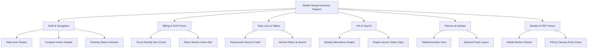

# Technical Feasibility Assessment: Mobile & Tablet Responsiveness Support

**Project:** RupeeCRM (Billsoft)  
**Date:** September 2026  
**Status:** Highly Feasible (100% Achievable with 0 Backend / API Changes)

---

## 1. Executive Summary

A comprehensive architectural and UX feasibility analysis was conducted on RupeeCRM (Simple-Billing) to evaluate the effort, complexity, and technical requirements needed to introduce full **Mobile & Tablet Responsiveness**.

### Key Findings:
- **Feasibility:** **100% FEASIBLE**
- **Backend/API Impact:** **ZERO (0%)** — All REST endpoints, business logic, DTOs, and controllers remain unchanged.
- **Frontend Layer:** Pure CSS responsive design + minimal React UI layout adaptations (such as card-view wrappers and bottom-sheet modals).
- **PWA Readiness:** `manifest.json` is already present with icon sets and theme colors; enabling mobile responsiveness allows the web app to function as an installable standalone mobile app on iOS and Android.

---

## 2. Current Architectural Baseline

| Aspect | Current Implementation | Mobile Readiness |
| :--- | :--- | :---: |
| **Viewport Meta Tag** | `<meta name="viewport" content="width=device-width, initial-scale=1.0" />` configured | ✅ Ready |
| **PWA Manifest** | `manifest.json` configured with `#4f46e5` theme & SVG vector brand logo | ✅ Ready |
| **Design System** | Clean CSS variables for colors, typography, elevations, borders, and transitions | ✅ Ready |
| **Layout Shell** | Fixed 260px desktop sidebar with basic hamburger media query at `768px` | 🟡 Needs Polish |
| **Data Tables** | Multi-column desktop `<table>` elements with rigid min-widths | 🔴 Needs Card Transformation |
| **Invoice / PO Editor** | Desktop grid with 7–8 columns per row (Product, Qty, Rate, Tax, Total) | 🔴 Needs Responsive Stacking |
| **Dialogs / Modals** | Center-screen fixed modals | 🟡 Convert to Bottom Sheets |

---

## 3. Module-by-Module Technical Assessment



### 3.1 Application Shell & Navigation
* **Desktop Behavior:** Permanent 260px left sidebar, wide topbar with firm switcher, global search, and persistent bottom metrics bar.
* **Mobile Design Pattern:**
  * **Sidebar:** Slide-over off-canvas drawer with smooth transition (`transform: translateX(0)`), touch backdrop overlay, and auto-close on navigation.
  * **Header:** Streamlined topbar featuring a hamburger icon, compact brand emblem, firm switcher modal, and an icon-only right action group (Theme Toggle, Notifications, Re-auth).
  * **Status Bar:** Minimizes into a collapsible floating status pill or docked bottom bar that doesn't obstruct viewport space.
* **Complexity:** **Low** (1–2 days)

---

### 3.2 Invoice & Estimate Creation (Billing & POS)
* **Challenge:** The invoice line items grid has 8 data columns (*Product, SKU, Qty, Unit, Unit Price, GST %, Total, Actions*), occupying ~850px width.
* **Mobile Design Pattern:**
  * **Card-Based Line Items:** Below 768px, each item converts from a `<tr>` table row into a self-contained, touch-friendly card:
    ```
    ┌──────────────────────────────────────────────┐
    │ 📦 Industrial Sensor X1             [✕ Delete]│
    │ SKU: SENS-001  •  Tax: 18% GST               │
    ├──────────────────────────────────────────────┤
    │ Qty: [ - 10 + ]    Price: [ ₹ 1,200.00 ]     │
    │ Total: ₹ 14,160.00 (Incl. GST)               │
    └──────────────────────────────────────────────┘
    ```
  * **Sticky Action Bar:** Subtotals, discount selector, and "Generate Invoice / Print" buttons stick to the bottom of the mobile viewport for one-tap access.
* **Complexity:** **Medium** (2 days)

---

### 3.3 Data Lists & Management (Invoices, Customers, Products, Parties)
* **Challenge:** 8-column tabular data causes horizontal clipping on small screens.
* **Mobile Design Pattern:**
  * **Responsive Grid Cards:** Tables automatically transform into readable cards showing essential metadata (Title/Name, Badge Status, Total Amount, Date) with a tap-to-expand or 3-dot context menu for actions (*Edit, Delete, Download PDF, Send*).
  * **Filter Bar:** Search input, date pickers, and category dropdowns stack into full-width controls with an optional collapsible "Filters" drawer.
* **Complexity:** **Low–Medium** (1.5 days)

---

### 3.4 Staff, HR & Payroll
* **Challenge:** Monthly attendance matrix displays 28–31 column days.
* **Mobile Design Pattern:**
  * **Mobile Attendance Carousel / Day Picker:** Switch from a full 31-day table to a weekly swipe view or daily roll-call list where employees can be marked *Present / Absent / Half-Day* with oversized touch targets.
  * **Payslip & Employee Statements:** Single-column KPI cards for gross salary, deductions, and net payable.
* **Complexity:** **Medium** (1.5 days)

---

### 3.5 Planner, Notes, Expenses & Inbox
* **Challenge:** Side-by-side Kanban columns and split-pane layout.
* **Mobile Design Pattern:**
  * **Tabbed Columns:** Kanban board switches to a tabbed segment control (*To Do (4) | In Progress (2) | Done (8)*).
  * **Expense Feed:** Clean vertical card stream with a Floating Action Button (FAB) `+` to log new expenses instantly.
* **Complexity:** **Low** (1 day)

---

### 3.6 Modals, Dialogs & Document Viewer
* **Challenge:** Desktop centered dialogs can overflow smaller phone heights.
* **Mobile Design Pattern:**
  * **Bottom Sheet Drawers:** Dialogs (Payment Entry, Customer Selector, Settings) slide up from the bottom with swipe-down-to-dismiss gesture and safe-area padding.
  * **PDF.js Viewer:** Scales to 100% mobile screen width with native touch pinch-to-zoom.
* **Complexity:** **Low** (1 day)

---

## 4. Breakpoint & Design System Architecture

```css
/* ─────────────────────────────────────────────────────────────
   Recommended Responsive Breakpoint System
   ───────────────────────────────────────────────────────────── */

/* Extra Small Phones (< 380px) - iPhone SE, small Androids */
@media (max-width: 380px) {
  :root { --font-size-base: 13px; }
  .kpi-grid { grid-template-columns: 1fr; }
}

/* Standard Mobile (381px – 640px) */
@media (max-width: 640px) {
  .sidebar { transform: translateX(-100%); }
  .sidebar.open { transform: translateX(0); }
  .table-responsive-cards thead { display: none; }
  .table-responsive-cards tr { display: block; margin-bottom: 12px; }
  .bottom-sheet-modal { border-radius: 16px 16px 0 0; bottom: 0; }
}

/* Tablets & Small Laptops (641px – 1024px) */
@media (min-width: 641px) and (max-width: 1024px) {
  .sidebar { width: 220px; }
  .kpi-grid { grid-template-columns: repeat(2, 1fr); }
}

/* Desktops & Large Displays (> 1024px) */
@media (min-width: 1025px) {
  .sidebar { width: 260px; }
  .kpi-grid { grid-template-columns: repeat(4, 1fr); }
}
```

---

## 5. Touch Target & Accessibility Guidelines

To ensure the mobile experience meets iOS Human Interface Guidelines and Android Material Design standards:
1. **Minimum Touch Targets:** All interactive controls (buttons, inputs, dropdowns, table actions) will have a minimum touch footprint of **44 × 44 px**.
2. **Safe Area Insets:** Support for modern notched displays via `padding-bottom: env(safe-area-inset-bottom)`.
3. **Prevent Accidental Zoom:** Form inputs formatted with `font-size: 16px` on mobile to prevent iOS Safari auto-zooming into text fields.
4. **Smooth Scroll & Fast Tap:** `touch-action: manipulation` and `-webkit-overflow-scrolling: touch` enabled across all scroll containers.

---

## 6. Implementation Roadmap & Timeline

```
┌──────────────────────────────────────────────┐
│ Phase 1: Shell & Navigation (Day 1)          │
│ • Mobile Drawer, Topbar, Touch Targets       │
├──────────────────────────────────────────────┤
│ Phase 2: Dashboards & List Cards (Days 2-3)  │
│ • KPI Grids, Invoices, Products, Customers   │
├──────────────────────────────────────────────┤
│ Phase 3: Billing POS & Item Cards (Days 3-4) │
│ • Invoice & PO Editor, Sticky Action Bar     │
├──────────────────────────────────────────────┤
│ Phase 4: HR, Modals & PDF Viewer (Day 5)     │
│ • Attendance Swiper, Bottom Sheets, PDF View │
└──────────────────────────────────────────────┘
```

---

## 7. Conclusion

Adding comprehensive mobile and tablet responsiveness to RupeeCRM is **straightforward, high-value, and zero-risk to backend integrity**. It will allow business owners, warehouse operators, and billing clerks to manage invoices, record payments, and monitor business analytics directly from any smartphone or tablet.
