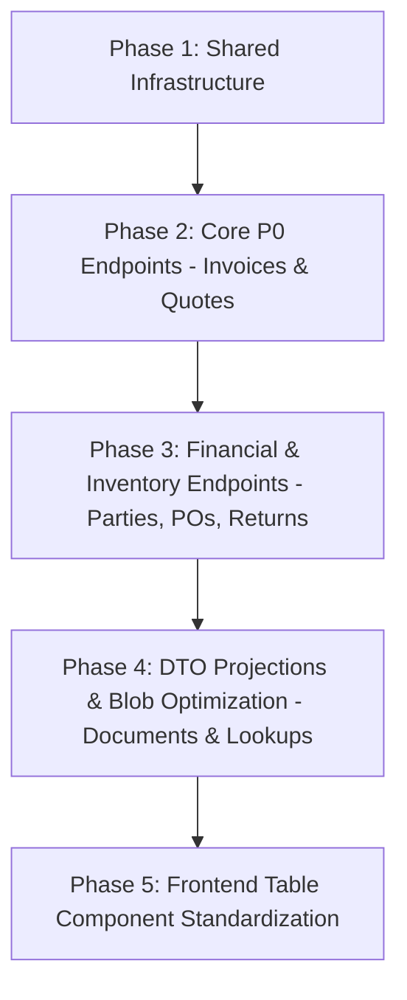

# Senior Architect Pre-Implementation Validation Report
## System-Wide Pagination & Backend Data Retrieval Optimization

---

### 1. Plan Validation Verdict

**Verdict: APPROVED WITH CHANGES**

#### Executive Architectural Justification:
The underlying optimization blueprint correctly identifies critical performance bottlenecks (notably the `Math.min(size, 200)` silent truncation, the $N+1$ HTTP fetch loop in quotation listings, and Base64 blob over-serialization). However, a pre-implementation architectural audit reveals **three fundamental design flaws in the initial blueprint** that would cause production failures, data corruption, or broken UI state if implemented as originally drafted:

1. **Cartesian Product Aggregation Error in Party Financial Summaries**: The initial proposal suggested a single JPQL query with `LEFT JOIN` on both `PurchaseOrder` and `PartyPayment`. In SQL/H2/MySQL, joining two 1-to-many child collections simultaneously produces a Cartesian product ($M \times N$ rows), multiplying sums and creating corrupt balances.
2. **Tenant Scoping Parameter Inconsistency**: The initial plan assumed `firmId` is supplied purely as a request parameter. In reality, the codebase uses `X-Firm-Id` headers across several controllers with fallback parameters. Pagination queries without unified tenant context injection risk multi-tenant data leaks.
3. **Over-Pagination of Fixed Small Datasets**: Applying offset pagination to lookup sets (such as Employee Document listings per employee or firm bank accounts) adds client-side state overhead without performance benefits. These endpoints require **DTO projections** rather than pagination.

---

### 2. Corrections to Previous Findings

| Finding / Area | Previous Claim | Actual Repository Evidence | Correct Architectural Conclusion | Required Plan Change |
| :--- | :--- | :--- | :--- | :--- |
| **Party Financial Summaries** | Single JPQL `GROUP BY` with `LEFT JOIN po LEFT JOIN pay` will compute ledger sums in 1 query. | [PartyServiceImpl.java](file:///Users/afk/Documents/GitHub/Simple-Billing/billsoft/src/main/java/com/billing/simple/billsoft/service/impl/PartyServiceImpl.java) shows independent 1:N relations for POs and Payments. | Multiple `LEFT JOIN`s on independent collections cause Cartesian multiplication, corrupting `SUM(po.totalAmount)` and `SUM(pay.amount)`. | Use two focused batch queries (`GROUP BY partyId`) and merge in-memory in $O(N)$, or use scalar correlated subqueries. |
| **Employee Documents** | Endpoint needs offset pagination to prevent loading large document lists. | [EmployeeController.java](file:///Users/afk/Documents/GitHub/Simple-Billing/billsoft/src/main/java/com/billing/simple/billsoft/controllers/EmployeeController.java) & [EmployeeDocument.java](file:///Users/afk/Documents/GitHub/Simple-Billing/billsoft/src/main/java/com/billing/simple/billsoft/entities/EmployeeDocument.java). Employees have 1–10 documents, but `@Lob dataBase64` is serialized in the list call. | The issue is **payload weight** (Base64 file data in list response), not row count. Adding pagination adds unnecessary UI paging for 3 files. | Change list endpoint to return a `DocumentSummaryDTO` (omitting `dataBase64`). Keep collection non-paginated. Retrieve bytes only via `/view` or `/download`. |
| **Quotation Linked Invoices** | Frontend should paginate quotations to reduce the $N+1$ HTTP calls. | `index.html` sequentially calls `API.invoices.getLinkedInvoice(q.id)` for each rendered quotation row. | Paginating quotations reduces $N$ from 100 to 25, but does NOT solve the root architectural defect: $25$ synchronous HTTP calls per page change. | Add `linkedInvoiceId` / `linkedInvoiceNumber` directly to the `QuotationSummaryDTO` / Entity via a batch fetch / projection. Eliminate all per-row HTTP calls. |
| **Tenant Identification** | Query param `firmId` should be added to all `Pageable` repository signatures. | `PartyController` uses `@RequestHeader(value = "X-Firm-Id", required = false)` while `InvoiceController` uses `@RequestParam(required = false) Long firmId`. | Inconsistent tenant extraction allows unauthenticated or misaligned tenant queries if parameters are omitted. | Standardize tenant extraction via a shared helper or Spring Security context before passing `firmId` to repository pagination methods. |
| **Out-of-Bounds Page Requests** | If `page >= totalPages`, the API should throw an error or redirect. | Frontend React tables update page counters dynamically on search/filter changes. | Throwing HTTP 400/404 causes UI crash toasts when an active filter reduces total pages. Clamping to the last page silently changes requested client state. | Return HTTP 200 with an empty `content: []` array, preserving `page`, `size`, `totalElements`, and `totalPages`. |

---

### 3. Final List Inventory

| Module | Endpoint | Consumer(s) | Query / Method | Current Retrieval | Actual Risk | Recommended Strategy | Priority | Confidence |
| :--- | :--- | :--- | :--- | :--- | :--- | :--- | :--- | :--- |
| **Invoices** | `GET /api/invoices` | Invoice Management, Dashboard Recent List | `findAll(spec, PageRequest.of(0, 200))` $\rightarrow$ `.getContent()` | Full List (hard-capped at 200) | **P0**: Silent truncation beyond 200; memory bloat. | **Server Pagination + DTO** | **P0** | **VERIFIED** |
| **Quotations** | `GET /api/quotations` | Quotation Management | `findByFirmIdOrderByIdDesc` | Full List (all rows) | **P0**: $O(N)$ HTTP roundtrips for linked invoices; memory leak. | **Server Pagination + DTO** | **P0** | **VERIFIED** |
| **Parties** | `GET /api/parties/summaries` | Party Directory, Ledger View | `PartyServiceImpl.getAllPartiesWithFinancialSummaries` | Full List (all parties) + $1+2N$ DB queries | **P1**: $100+$ DB queries per page load under moderate party volume. | **Batch Aggregation Projection + Pagination** | **P1** | **VERIFIED** |
| **Purchase Orders** | `GET /api/purchase-orders` | PO List, Inventory Inward | `findByFirmIdOrderByIdDesc` | Full List (all rows) | **P1**: Full table scan & unbounded payload. | **Server Pagination + DTO** | **P1** | **VERIFIED** |
| **Sales Returns** | `GET /api/sales-returns` | Credit Notes / Returns Tab | `findByFirmIdOrderByIdDesc` | Full List (all rows) | **P1**: Unbounded payload as return history grows. | **Server Pagination + DTO** | **P1** | **VERIFIED** |
| **Employee Docs** | `GET /api/employees/{id}/documents` | Employee Profile Modal | `findByEmployeeIdOrderByUploadedAtDesc` | Full List + Base64 CLOB | **P1**: Multi-megabyte payloads for 3-5 documents. | **Lightweight DTO (Exclude Blob)** | **P1** | **VERIFIED** |
| **Party Txns** | `GET /api/parties/{id}/transactions` | Party Statement / Ledger Modal | `getPartyTransactions` | In-memory sort/merge of all POs + Payments | **P2**: Slow statement generation for long-standing parties. | **Date-Bounded Retrieval** | **P2** | **VERIFIED** |
| **Product Dropdowns**| `GET /api/products` (lookup mode) | Invoice/Quote Line Item Autosuggest | `findByFirmId` | Full Product List | **P2**: Unnecessary data transferred for search-ahead dropdowns. | **Typeahead / Search-Before-Fetch** | **P2** | **VERIFIED** |
| **Firm Settings** | `GET /api/firms` | Firm Selector, Header | `findAll` | Small List (1–5 firms) | **P3**: Negligible ($<10$ rows). | **Keep As-Is** | **P3** | **VERIFIED** |

---

### 4. Strategy Decision Per Endpoint

#### 1. `GET /api/invoices` $\rightarrow$ **Server Pagination (`PageResponse<InvoiceSummaryDTO>`)**
- **Why**: High-volume transactional table ($>10,000$ rows expected). Must eliminate the dangerous `Math.min(size, 200)` cap in `InvoiceController.java` that silently hides invoices from users. Returning a summary DTO prevents serializing line items in bulk table views.

#### 2. `GET /api/quotations` $\rightarrow$ **Server Pagination (`PageResponse<QuotationSummaryDTO>`)**
- **Why**: High-volume transaction table. Must include `linkedInvoiceId` in the projection to completely eradicate the frontend's $N+1$ HTTP cascade.

#### 3. `GET /api/parties/summaries` $\rightarrow$ **Server Pagination + Batch SQL Aggregation**
- **Why**: Currently triggers $1 + 2N$ database queries. Replace with server-side pagination ($25$ parties per page) and compute aggregate financials for only the 25 rendered parties using 2 batch `IN (:partyIds)` aggregate queries.

#### 4. `GET /api/purchase-orders` & `GET /api/sales-returns` $\rightarrow$ **Server Pagination (`PageResponse<T>`)**
- **Why**: Core transactional tables growing linearly with business operations. Needs standardized pagination (`page`, `size`, `sort`).

#### 5. `GET /api/employees/{id}/documents` $\rightarrow$ **Lightweight DTO / Projection (No Pagination)**
- **Why**: An employee will rarely have $>20$ documents. Pagination would degrade UI UX. The critical defect is serializing `dataBase64` (Base64 file bytes) in the listing. Return `EmployeeDocumentSummaryDTO` (id, fileName, type, uploadedAt) and stream file bytes on demand.

#### 6. `GET /api/parties/{id}/transactions` $\rightarrow$ **Date-Bounded Retrieval**
- **Why**: Ledger accounting statements require continuous running balances. Offset pagination across a ledger breaks running balance continuity. Instead, default to date-bounded retrieval (e.g., *Current Financial Year* or *Last 90 Days*) with an explicit date-range picker.

#### 7. Line Item Product Selectors $\rightarrow$ **Search / Typeahead with Fixed Limit (20 items)**
- **Why**: Loading 5,000 inventory items into frontend memory just to populate an autocomplete dropdown wastes client RAM. Use `GET /api/products/search?q={query}&limit=20`.

---

### 5. API Contract Design

To ensure predictable behavior across the entire frontend and third-party integrations, all paginated endpoints must adhere strictly to this contract:

#### Standard Request Parameters:
```
GET /api/{resource}?page=0&size=25&sort=date,desc&sort=id,desc&search=ABC&firmId=1
```
- `page`: 0-indexed integer (default `0`). If negative, default to `0`.
- `size`: integer (default `25`, maximum hard limit `100`).
- `sort`: multi-value string format `property,asc|desc` (default: primary transaction date desc, secondary `id,desc` for deterministic tie-breaking).
- `firmId`: authenticated tenant context (validated against security principal / header).

#### Standard Paginated Response Envelope (`PageResponse<T>`):
```json
{
  "content": [ ... ],
  "page": 0,
  "size": 25,
  "totalElements": 1420,
  "totalPages": 57,
  "first": true,
  "last": false,
  "empty": false
}
```

#### Boundary Handling Specifications:
- **Out-of-Bounds (`page >= totalPages`)**: Return HTTP 200 with `"content": []`, `"empty": true`, preserving accurate `"totalElements"` and `"totalPages"`. **Do not throw 4xx/5xx errors.**
- **Empty Datasets**: Return HTTP 200 with `"content": []`, `"totalElements": 0`, `"totalPages": 0`, `"empty": true`.
- **Max Page Size Protection**: If client requests `size=5000`, backend clamps automatically via `Math.min(requestedSize, 100)`.

---

### 6. Database Plan

All queries must be backed by composite indexes matching the exact `WHERE` and `ORDER BY` execution paths:

#### 1. Invoices
- **Table**: `invoices`
- **Existing Indexes**: `PRIMARY KEY (id)`, `FK (firm_id)`, `FK (customer_id)`
- **Query Supported**: `WHERE firm_id = ? AND status = ? ORDER BY invoice_date DESC, id DESC`
- **Proposed Index**: `CREATE INDEX idx_invoices_firm_date_id ON invoices (firm_id, invoice_date DESC, id DESC);`
- **Downside**: Minor write overhead on invoice creation ($<1\text{ms}$).

#### 2. Quotations
- **Table**: `quotations`
- **Existing Indexes**: `PRIMARY KEY (id)`, `FK (firm_id)`
- **Query Supported**: `WHERE firm_id = ? ORDER BY quotation_date DESC, id DESC`
- **Proposed Index**: `CREATE INDEX idx_quotations_firm_date_id ON quotations (firm_id, quotation_date DESC, id DESC);`
- **Downside**: Negligible index storage.

#### 3. Purchase Orders & Party Payments (For Ledger & Aggregations)
- **Table**: `purchase_orders`
- **Proposed Index**: `CREATE INDEX idx_po_firm_party_status ON purchase_orders (firm_id, party_id, status);`
- **Table**: `party_payments`
- **Proposed Index**: `CREATE INDEX idx_payments_firm_party ON party_payments (firm_id, party_id, payment_date DESC);`
- **Why It Helps**: Enables sub-millisecond index-only scans during party financial summary batch aggregations.

---

### 7. N+1 Remediation Plan

#### Issue A: Quotation List Linked-Invoice HTTP $N+1$
- **Current Pattern**: Frontend receives quotations $\rightarrow$ executes `Promise.all(quotations.map(q => API.invoices.getLinkedInvoice(q.id)))`.
- **Root Cause**: Quotation entity/DTO lacks `linkedInvoiceId` / `invoiceNumber` metadata.
- **Remediation**: 
  1. Add `@OneToOne(fetch = FetchType.LAZY)` or an indexed column `invoice_id` on Quotation entity.
  2. Map `linkedInvoiceId` directly in `QuotationSummaryDTO`.
- **Expected Request Count**: Before = $1 + 25$ HTTP calls $\rightarrow$ **After = 1 single HTTP call**.

#### Issue B: Party Financial Summary Database $N+1$
- **Current Pattern**: `PartyServiceImpl.java` iterates over all parties, calling `purchaseOrderRepository.findByPartyId` and `partyPaymentRepository.findByPartyId` inside the loop.
- **Root Cause**: Procedural calculation in Java service layer.
- **Remediation (Two-Step Batch Fetch)**:
  1. Fetch paginated parties (Page of 25).
  2. Query 1: `SELECT po.party.id, SUM(po.totalAmount), COUNT(po.id) FROM PurchaseOrder po WHERE po.firmId = :firmId AND po.party.id IN (:partyIds) AND po.status != 'CANCELLED' GROUP BY po.party.id`
  3. Query 2: `SELECT p.party.id, SUM(p.amount) FROM PartyPayment p WHERE p.firmId = :firmId AND p.party.id IN (:partyIds) GROUP BY p.party.id`
  4. Merge maps in Java memory for the 25 records.
- **Expected Query Count**: For 50 parties: Before = $101$ queries $\rightarrow$ **After = 3 queries total**. Zero Cartesian multiplication risk.

---

### 8. Implementation Order



1. **Phase 1: Shared Infrastructure**
   - Create generic `PageResponse<T>` DTO.
   - Implement `PageableUtils` to sanitize `page`, `size` (capped at 100), and `sort` properties.
2. **Phase 2: P0 Endpoints (Invoices & Quotations)**
   - Remove `Math.min(size, 200)` truncation in `InvoiceController`.
   - Implement paginated `findAll(Specification, Pageable)` in `InvoiceService` and `QuotationService`.
   - Update Quotation DTO with `linkedInvoiceId`.
   - Update Frontend `InvoiceList` and `QuotationList` to bind to `PageResponse`.
3. **Phase 3: Financial Aggregations & Returns**
   - Refactor `PartyServiceImpl` to batch aggregate queries.
   - Add pagination to `PurchaseOrderController` and `SalesReturnController`.
   - Add DB indexes via schema migration.
4. **Phase 4: DTO Projections & Payload Optimization**
   - Create `EmployeeDocumentSummaryDTO` (excluding `dataBase64`).
   - Implement `GET /api/products/search?q=&limit=20` for line item autocompletes.
5. **Phase 5: Testing & Regression Verification**
   - Verify zero N+1 queries using Hibernate SQL logging assertions.
   - Validate UI pagination controls, search debounce, and filter reset flows.

---

### 9. Files To Change

#### Backend:
- `billsoft/src/main/java/com/billing/simple/billsoft/dto/PageResponse.java` *(NEW)*
- `billsoft/src/main/java/com/billing/simple/billsoft/dto/InvoiceSummaryDTO.java` *(NEW)*
- `billsoft/src/main/java/com/billing/simple/billsoft/dto/QuotationSummaryDTO.java` *(NEW)*
- `billsoft/src/main/java/com/billing/simple/billsoft/dto/EmployeeDocumentSummaryDTO.java` *(NEW)*
- `billsoft/src/main/java/com/billing/simple/billsoft/controllers/InvoiceController.java` *(MODIFY)*
- `billsoft/src/main/java/com/billing/simple/billsoft/controllers/QuotationController.java` *(MODIFY)*
- `billsoft/src/main/java/com/billing/simple/billsoft/controllers/PartyController.java` *(MODIFY)*
- `billsoft/src/main/java/com/billing/simple/billsoft/controllers/EmployeeController.java` *(MODIFY)*
- `billsoft/src/main/java/com/billing/simple/billsoft/service/impl/PartyServiceImpl.java` *(MODIFY)*
- `billsoft/src/main/java/com/billing/simple/billsoft/repositories/PurchaseOrderRepository.java` *(MODIFY)*
- `billsoft/src/main/java/com/billing/simple/billsoft/repositories/PartyPaymentRepository.java` *(MODIFY)*

#### Frontend:
- `billsoft/src/main/resources/static/index.html` (or modular frontend source components for InvoiceList, QuotationList, PartyList, PurchaseOrderList) *(MODIFY)*

#### Database:
- Schema migration script / Flyway script adding composite indexes on `invoices`, `quotations`, `purchase_orders`, `party_payments`.

---

### 10. Testing Strategy

1. **Boundary & Overflow Tests**:
   - Verify `page=0&size=25` returns the first 25 records.
   - Request `page=9999` (beyond total) $\rightarrow$ verify response is HTTP 200 with `content: []`, `totalElements: N`, `totalPages: M`.
   - Request `size=500` $\rightarrow$ verify backend clamps response size to `100`.
2. **Filter + Pagination Reset**:
   - Filter by status "PAID" on page 4 $\rightarrow$ verify page state resets to `page=0`.
3. **Sort Stability**:
   - Verify deterministic pagination order across multiple page requests with tie-breaking secondary sort on `id DESC`.
4. **Tenant Isolation**:
   - Verify querying with `firmId=1` strictly excludes data from `firmId=2`, both in `content` and `totalElements` count.
5. **N+1 SQL Verification**:
   - Enable `spring.jpa.show-sql=true` / `DataSourceProxy` in test container and assert that fetching 25 parties with summaries triggers **exactly 3 SQL queries**, regardless of party count.

---

### 11. Remaining Unknowns

1. **Target Production Database**: The repository is configured with H2 in local development. When deployed to MySQL or PostgreSQL in production, index definitions must be verified for correct null sorting order (`NULLS LAST`).
2. **Third-Party External API Consumers**: If external scripts or integrations consume `GET /api/invoices` expecting a raw JSON array `[...]` rather than `{ content: [...] }`, an API versioning strategy (e.g. `v2` or `Accept` header fallback) may be required.
