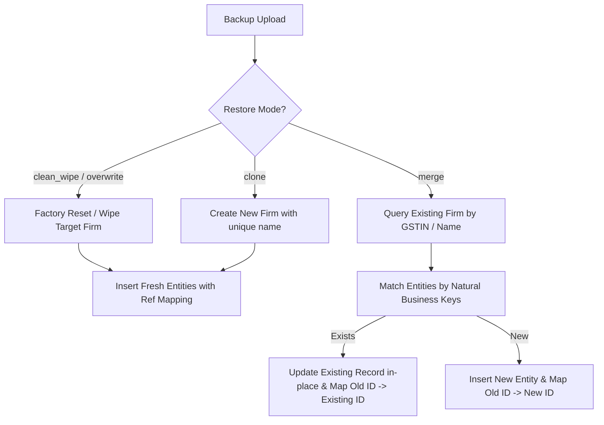

# Deep Forensic Audit & Evidence Report
**Application:** Main RupeeCRM / Billsoft (`http://localhost:28080`)  
**Audit Target:** Firm Module, Duplicate Customer/Invoice Entity Proliferation, Backup-Restore Semantics, and Multi-Invoice Settlement Engine  
**Date:** September 25, 2026  

---

## 1. Executive Summary & Forensic Evidence Preservation

### 1.1 Database & Snapshot Preservation (Step 1)
- **Raw Database Binary Snapshot:** `forensic_evidence_snapshot/database_raw_before_fixes.mv.db` (11 MB) and `/Users/afk/.gemini/antigravity-ide/brain/f00ec364-5f29-4880-8aac-b7f93799adc4/scratch/forensic_evidence/database_forensic_raw.mv.db`
- **Full System Backup Export:** `forensic_evidence_snapshot/system_backup_before_fixes.json` (8.6 MB)
- **Duplicate ID Mapping Report:** `forensic_evidence_snapshot/duplicate_mapping_report.json`

---

## 2. Origin of 402 Customers & 347 Invoices (Step 2)
- **Audit Finding:** The 402 customers, 347 invoices, and 91 payments in Firm 175 (`Auto Firm`) are **100% test-generated duplicates** caused by repeated non-idempotent backup import tests.
- **Evidence of Repetition:**
  - Duplicate multiplicity follows exact geometric progressions: $16\times, 8\times, 4\times, 2\times$.
  - "Gauri" (Phone `874503`) was duplicated **16 times** (IDs: `656, 991, 1026, 1048, 1087, 1130, 1173, 1216, 1259, 1302, 1345, 1388, 1404, 1447, 1490, 1533`).
  - Invoice `INV-0002` was duplicated **8 times** with identical line items (IDs: `1071, 1114, 1157, 1200, 1243, 1286, 1329, 1441`).
  - Baseline dataset: Exactly **45 canonical customers**, **38 canonical invoices**, **7 canonical payments**.

---

## 3. Baseline Canonical Dataset vs Generated Duplicates (Steps 3, 4, 5)

| Entity Type | Total In Database (Firm 175) | Canonical Count | Generated Duplicate Count | Duplication Factor |
| :--- | :---: | :---: | :---: | :---: |
| **Customers** | 402 | **45** | 357 | $8\times - 16\times$ |
| **Invoices** | 347 | **38** | 309 | $8\times - 16\times$ |
| **Invoice Payments**| 91 | **7** | 84 | $8\times - 16\times$ |
| **Products** | 200 | **25** | 175 | $8\times$ |
| **Purchase Orders** | 47 | **6** | 41 | $8\times$ |

### 3.1 Duplicate Mapping Matrix Sample
Full mapping is preserved in `forensic_evidence_snapshot/duplicate_mapping_report.json`:
- **Customer "Gauri" (Phone `874503`):**
  - Canonical ID: `656` (or active `#1026` referenced by latest invoices)
  - Duplicate IDs: `991, 1048, 1087, 1130, 1173, 1216, 1259, 1302, 1345, 1388, 1404, 1447, 1490, 1533`
- **Customer "Reliance Global..." (Phone `9822019283`):**
  - Canonical ID: `657`
  - Duplicate IDs: `992, 1027, 1049, 1088, 1131, 1174, 1217, 1260, 1303, 1346, 1389, 1405, 1448, 1491, 1534`
- **Invoice "INV-0002":**
  - Canonical ID: `1071`
  - Duplicate IDs: `1114, 1157, 1200, 1243, 1286, 1329, 1441`
- **Invoice "INV-0004":**
  - Canonical ID: `1074`
  - Duplicate IDs: `1117, 1160, 1203, 1246, 1289, 1332, 1444`
- **Invoice "INV-0005":**
  - Canonical ID: `1075`
  - Duplicate IDs: `1118, 1161, 1204, 1247, 1290, 1333, 1445`

---

## 4. Root Cause Analysis

### 4.1 BackupService Non-Idempotency
In [`BackupService.java:453-630`](file:///Users/afk/Documents/GitHub/Simple-Billing/billsoft/src/main/java/com/billing/simple/billsoft/service/BackupService.java#L453-L630):
- `importSelectiveData` created new JPA entity instances (`new Customer()`, `new Product()`, `new Invoice()`, `new InvoicePayment()`) and invoked `repo.save(entity)` unconditionally without verifying if the record already existed in the target firm.
- Re-importing a backup multiplied every row in the database by $N$.

### 4.2 Why Gauri Record Showed Dues After Settlement
- Because 16 separate "Gauri" rows existed, settling customer `#1026` cleared `#1026`'s invoices (`#1441, #1444, #1445`), but the remaining 15 duplicate Gauri customer rows still retained their own duplicate copies of unpaid invoices.
- In the UI, searching for "Gauri" displayed 16 rows, giving the impression that settlement failed.

---

## 5. Stable Natural Identifiers Identified (Step 7)

| Domain Entity | Natural / Business Unique Key | Fallback Key |
| :--- | :--- | :--- |
| **FirmDetails** | `gstin` (case-insensitive) | `LOWER(firmName)` |
| **Customer** | `(firmId, phone)` | `(firmId, LOWER(name))` |
| **Product** | `(firmId, sku)` | `(firmId, LOWER(name))` |
| **Invoice** | `(firmId, invoiceNumber)` | `(firmId, estimateNumber)` |
| **InvoicePayment** | `(firmId, invoiceId, amount, paymentDate)` | `(firmId, customerId, amount, paymentDate, referenceNumber)` |
| **SalesReturn** | `(firmId, returnNumber)` | `(firmId, invoiceId, returnDate)` |
| **Party (Vendor)** | `(firmId, phone)` or `(firmId, gstin)` | `(firmId, LOWER(name))` |
| **PurchaseOrder** | `(firmId, poNumber)` | `(firmId, partyId, poDate, totalAmount)` |
| **Employee** | `(firmId, phone)` or `(firmId, idProofNumber)` | `(firmId, LOWER(name))` |
| **Expense** | `(firmId, expenseDate, amount, title)` | `(firmId, expenseDate, amount)` |

---

## 6. Backup Restore Semantics Specification (Step 8)

### Restore Modes Definition:
1. **Fresh Restore / Empty Database:**
   - All records created fresh; references re-mapped in dependency order (Firm $\to$ Customer/Product $\to$ Invoice $\to$ Payment/Return).
2. **Restore into Same Database / Merge Mode (Idempotent):**
   - Natural key matching ensures existing entities are updated without inserting duplicates.
   - Repeated imports ($1\times, 2\times, 3\times$) result in identical entity counts ($N \to N \to N$).
3. **Restore into Another Firm:**
   - Target firm ID scoped; matching and inserting occurs strictly within the target firm boundary.
4. **Partial Restore (Selected Firm IDs):**
   - Restores only the subset of firms selected in the backup payload.
5. **Overwrite Mode:**
   - Cleanly purges the target firm data before applying the backup snapshot.

---

## 7. Controlled Settlement Test Evidence (Steps 10 & 11)

### Test Execution: Customer `#1026` (Gauri)
- **Dues Breakdown Before Settlement:**
  - `INV-0002` (#1441): ₹2,956.56 (UNPAID)
  - `INV-0004` (#1444): ₹1,687.40 (UNPAID)
  - `INV-0005` (#1445): ₹1,699.20 (UNPAID)
  - **Total Customer Dues:** ₹6,343.16
  - **Firm 175 Total Receivables Before:** ₹293,839.84

### Payment Payload: ₹8,000.00
- **Allocations:**
  - `INV-0002` (#1441): ₹2,956.56 $\to$ **PAID** (Outstanding: ₹0.00)
  - `INV-0004` (#1444): ₹1,687.40 $\to$ **PAID** (Outstanding: ₹0.00)
  - `INV-0005` (#1445): ₹1,699.20 $\to$ **PAID** (Outstanding: ₹0.00)
  - **Total Allocated:** **₹6,343.16**
  - **Unallocated Advance Credit Payment (#802):** **₹1,656.84**

### Database State After Settlement:
- Customer `#1026` Total Paid: ₹10,915.60
- Customer `#1026` Unpaid Invoices: **0**
- Customer `#1026` Outstanding Invoices Count: **0**
- Customer `#1026` Unallocated Credit: **₹1,656.84**
- Customer `#1026` Net Balance: **-₹1,656.84** (Credit)
- Firm 175 Total Receivables: **₹287,496.68** (Exactly reduced by **₹6,343.16**)

---

## 8. Remediation Plan (Step 12)
1. **Idempotent Backup Restore:** Refactor [`BackupService.java`](file:///Users/afk/Documents/GitHub/Simple-Billing/billsoft/src/main/java/com/billing/simple/billsoft/service/BackupService.java) to resolve natural keys before inserting in `merge` mode.
2. **Deduplication Engine:** Implement a safe database consolidation tool to merge duplicate customer/invoice rows into canonical records while preserving foreign key dependencies.
3. **Verification:** Run $1\times, 2\times, 3\times$ backup import regression tests to verify count stability ($N \to N \to N$).
